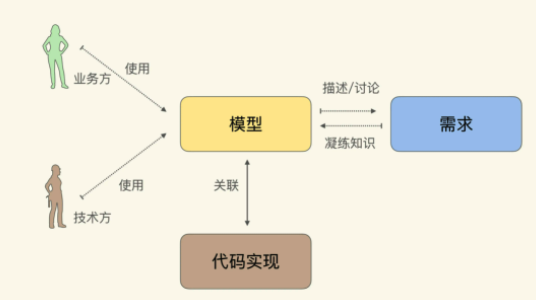
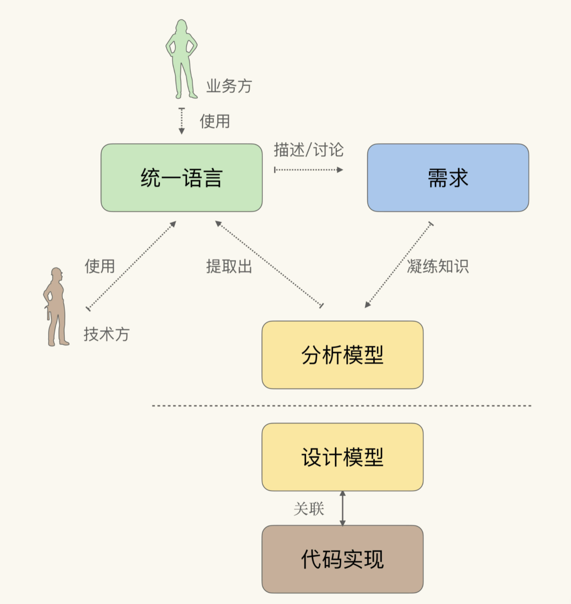

## 业务建模
### 解决问题还是定义问题
业务建模首先是一个定义问题的方法，其次才是解决问题的方法。我们很容易理解解决问题带来的价值，但也很容易忽略定义问题的力量。如果问题定义得准确，那么实现起来也不会太复杂；相反，如果没有搞清楚要解决什么问题，就可能需要用各种奇技淫巧去弥补问题定义的不足。我们有时为了逃避真正的思考，愿意做任何事。

为了有效定义问题，需要从业务出发，首先尝试在业务中寻找简化问题的可能性，然后在技术中寻找对应的解决方案。
明确业务中的关键问题，使用易于实现的模型讲业务问题表达出来。

### 业务建模的难点
而一旦涉及软件开发的核心难点，也就是处理隐藏在业务知识中的核心复杂度，除了清晰得理解业务诉求之外，还需要通过建模的方式对这种复杂的进行简化与精炼。
业务建模的方法有很多种，比如着眼于数据库设计的实体关系法（E-R Modeling）、面向对象分析与设计法（Object Oriented Analysis and Design），围绕知识消化的领域驱动设计（Domain Driven Design）等等。
业务建模的真正难点并不在于建模本身，而是：
1. 清晰地定义业务问题，并让所有干系人都接受你对业务问题的定义；
2. 在特定架构的约束下，将模型实现出来。

#### 如何定义问题并让所有人接受
这里的定义业务问题，是指对业务问题的梳理和总结，明确对业务的影响及产出。
这就需要对业务进行提炼总结，并通过所选用的业务建模方法中蕴含的逻辑框架去验证它。如果发现漏洞和不足，要及时提出，让人参与讨论。
这里的挑战不是建模本身，而是如何获取业务方的信任，并展开有效的讨论。
这是能否有效使用业务建模方法的关键。

#### 如何在特定架构下实现模型
建模方法有着更长的生命周期，而技术架构却在不断演化。如果忽略架构对模型的影响，往往会因为不知道如何处理架构约束，而无法将其运用到实际工作中。

#### 针对上述两个难点，学习业务建模需要注意
- 转移关注点，不必太在意模型是否完美，是否在概念上足够抽象，是否使用了模式。反而，更应该关注如何围绕模型，建立有效的沟通、反馈机制。即该怎么将模型中蕴含的逻辑讲给别人，并让别人听懂、并给出反馈。
- 对架构演化趋势保持足够的关注度。一般没3-5年就会出现新的架构风格。过去15年经历了从单体到多层，再到微服务的改变。在不同的架构风格下，业务建模和模型实现模式的最佳实践会存在差异，而这些差异很可能会决定建模的成败。

## 领域驱动设计
说起业务建模，领域驱动设计（Domain Driven Design）是一个绕不开的话题。
软件开发的核心难点在于处理隐藏在业务知识中的复杂度，那么模型就是对这种复杂度的简化与精炼。领域驱动设计是一种模型驱动的设计方法，通过领域模型（Domain Model）捕捉领域知识，使用领域模型构造更易维护的软件。

模型在领域驱动设计中有三个用途：
1. 通过模型反映软件实现的结构；
1. 以模型为基础形成团队的统一语言（Ubiquitous Language）；
1. 把模型作为精粹的知识，以用于传递；
这样的好处：
1. 理解了模型，就大致理解了代码的结构；
1. 在讨论需求时，研发人员可以很容易明白需要改动的代码，并对风险与进度有更好的评估；
1. 模型比代码更简洁、更抽象，有更低的传递成本；

### 领域模型对于业务系统是更好的选择
“程序=算法+数据结构”这个著名的公式来自于软件行业早期，当时堆、栈、链表等与领域无关的模型，帮开发人员解决了编译器、内存管理、索引等大量的基础问题。这让从业人员形成了一种习惯：**将问题转化为与具体领域无关的数据结构，即构造与具体领域无关的模型**。
而领域驱动设计则是对这种习惯的挑战，它提倡**对于业务软件而言，从业务出发去构造与业务强相关的模型，是一种更好的选择**。
因为如果我们构造的是业务系统，那么团队中就会引入不具有开发背景的业务方参与；这种情况下，与领域无关的数据结构及算法，业务方是不了解的；这种认知上的差异，会造成团队沟通的困难，破坏同一语言，加剧知识传递的难度。
于是在业务系统中，**构造一种专用的模型（领域模型），将相关的业务流程与功能转化为模型的行为，就能避免开发人员与业务的认知差异**。所以领域模型对于业务系统是更好的选择。
这种理念的转变是以面向对象技术开始，直到DDD被行业采纳，才最终完成的。

### 知识消化
不同于软件行业对数据结构的尝试研究与积累，在不同的领域中该使用什么样的领域模型，并没有一个现成的做法。因而在DDD中，Eric Evans提倡了一种叫知识消化（Knowledge Crunching）的方法帮助我们去提炼领域模型。多年来产生了多种知识消化的方法，但它们在宏观上仍然遵从知识消化的五个步骤。

#### 知识消化的五个步骤
1. 关联模型与实现；
2. 基于模型提取统一语言；
3. 开发富含知识的模型；
4. 精炼模型；
5. 头脑风暴与试验；

其中“关联模型与实现”是知识消化可以顺利进行的前提与基础，它将模型与代码统一在一起，使得对模型的修改，等同于对代码的修改。
“基于模型提取统一语言”则会将业务方变成模型的使用者，通过同一语言进行需求讨论，实际上就是通过模型对需求进行讨论。
后面三步则构成了一个提炼知识的循环：通过同一语言讨论需求；发现模型中的缺失或者不恰当的概念，精炼模型以反映业务的实践情况；对模型的修改引发了统一语言的改变，再以试验和头脑风暴的态度，使用新的语言以验证模型的准确。如此循环往复，不断完善模型与统一语言：


以上五步可以总结为“两关联，一循环”：
- 模型与软件实现关联；统一语言与模型关联；
- 提炼知识的循环；

### 模型与软件实现关联
与模型关联的实现方法，是一种面向对象的编程风格，即“富含知识的模型”（Knowledge Rich Model）,与之相对的，过程式的编程风格，则是一种与模型无关的实现方式。面向对象对象技术在表达领域模型上有天生的优势。

#### 从贫血模型到富含知识的模型
在“贫血对象模型”中，**对象仅仅对简单的数据进行封装，而关联关系和业务计算都散落在对象的范围之外**。
比如极客时间的用户和订阅专栏是一对多的关系，“贫血对象模型”类似下面的伪代码：
```
class UserDAO{
    public User find(long id){
        var query = connection.createConnection();
        ResultSet result = query.executeQuery();
        return new User(rs.getLong(1),rs.getString(2));
    }
}

class SubscriptionDAO{
    public List<Subscription> findSubscriptionsByUserId(long userId){
        ...
    }
}
```
这样的代码风格沿用过程式方式，没有发挥面向对象技术的优势。
与之相对的则是“充血模型”，即“**与某个概念相关的主要行为与逻辑，都被封装到了对应的领域对象中**”。这也就是DDD中强调的“富含知识的模型”。按照这种风格，上面的代码可以改写为：
```
class User{
    public List<Subscription> getSubscriptions(){
        ...
    }
}

class UserRepository{
    public User findById(long id){

    }
}
```
从这段代码很容易看出：User是聚合根，Subscription被聚合到User中，无法独立存在。

#### 通过聚合关系表达业务概念
在建模中采用的关联关系中，聚合关系表示关联在一起的对象，从概念上讲是一个整体。在User与Subscription的关系中，如果脱离了Subscription，Use只是单纯的表示个人信息，而脱离了User，Subscription也只是专栏内容，只有把两者放在放在一起，才能表达需要的含义：User订阅的Subscription，它们是一个整体。
比起贫血模型的实现方式，充血模型将模型与软件实现完全对应在一起的，无论是结构还是行为。这简化了理解代码的难度。只要在概念上理解了模型，就会大致理解代码的实现方法与结构。

#### 修改模型就是修改代码
关联模型与软件实现，最终的目的是：修改模型就是修改代码；修改代码就是修改模型。
在知识消化中，提炼知识的重构是围绕模型展开的。如果对于噢模型的修改，无法直接映射到软的实现上（比如贫血模型），那么提炼知识的重构循环就必须停下来，带这个同步的过程；否则模型与软件将的割裂，就会将模型本身分裂为更接近业务的分析模型，以及更接近实现的设计模型，这个时候分析模型就会逐渐退化为纯粹的沟通需求的工具，而一旦脱离了实现的约束，分析模型就会变的天马行空，不着边际。

这套做法被无数案例证明难以成功，于是才有了后来的DDD等使用同=统一模型的方法。

#### 参考资料
极客时间：如何落地业务建模 徐昊