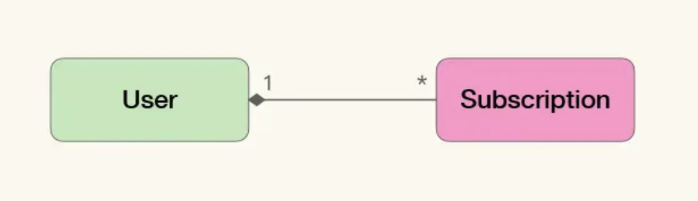

DDD的核心理念，即在业务系统中使用与问题域相关的模型，而不是通用的数据结构去描述问题。
既然领域驱动设计是一种模型驱动的设计方法，为什么不能让业务方直接去使用模型，而要通过统一语言呢？

### 统一语言是基于领域模型的共同语言
统一语言（Ubiquitous Language）是基于领域模型的共同语言，业务方与技术方通过共同语言描述业务规则与需求变动，为双方提供了协作、沟通的基础。这里的业务方泛指一切非最终软件实现者，比如客户、产品经理、业务分析师、解决方案架构师、用户体验设计师等。
共同语言也有很多种形式，如用户画像、用户旅程、数据字典等；但DDD的统一语言特指根据领域模型构造的共同语言。
回到开始的问题：“既然领域驱动设计是一种模型驱动的设计方法，为什么不能让业务方直接去使用模型，而要通过统一语言呢？”

这是因为这样做的效果不理想：
- 对于研发人员来说，直接使用模型有很多好处，但对业务方来说却不够直观。业务方大多习惯从业务角度如流程、交互、功能、价值等去描述系统，而模型则偏重于数据角度，描述了在不同业务维度下，数据将会如何变化，以及如何支撑对应的计算与统计，业务维度被模型的抽象隐藏了，使业务方无法从模型中直接感知到业务维度。
- 模型是从已知需求中总结提炼的知识，这就意味着模型无法表达未知需求中尚未提炼的知识。所以需要一个相对允许歧义与未知的隔离层，来帮助我们发现和反馈模型的不足。
- 总结来说，需要一种能与模型关联的共同语言，它既能让模型在核心位置扮演关键角色，又能弥合视角差异，并提供足够的缓冲。从模型中提取的统一语言，覆盖了领域模型中的概念与逻辑，还提供了必要的补充，以帮助业务方理解模型。同时，统一语言也扮演了试验田的角色，其中出现的未被提取的知识，将触发提炼知识的循环，逐步完善模型。
相对于模型的精确，统一语言的模糊反而更能满足人与人之间交流的需求。

### 修改代码就是改变统一语言
统一语言是从模型中提取的，于是，修改代码就是修改模型，也会改变统一语言。所以，不仅是因为需求变更，代码重组引起的代码修改，最终也会反映到统一语言中。
这相当于让开发方来定义业务问题，并要求业务方按照开发提出的模型来描述业务和需求。一旦将软件实现与领域模型关联，那么对实现的简化，也就是对领域问题的简化；从实现中抽取的抽象概念，也就是从问题域中抽取的抽象概念。
这种看起来匪夷所思的情况，实际上一直都在发生，技术方一直都在定义业务，只是没有合理的途径让业务方了解并接纳。
统一语言及其背后的领域模型从观念上改变了这一状况，他将大家从各自的落地，也就是业务与技术中，拉到了一个中间地带。双方有了差不多的话语权。
而一旦业务方接受了统一语言，实际上就是放弃了对业务100%的控制权，也就意味着统一语言在业务上能够赋予开发人员更大的控制权，赋予了开发人员定义业务的权力。不多在带来权力的同时，也隐含着额外的义务，即借由统一语言，在提炼知识的循环中，接受业务方的监督与反馈；如果业务方不同意技术方修改的模型，可以修正这种误差，也就是技术人员也丧失了对代码100%的控制权。

总结来说，统一语言提供了一种更好的协同方式的可能性，建立了技术反馈业务的途径，降低了知识消化过程失败的风险。

### 一个简单的统一语言提案
统一语言本身的形式并不重要，或者说并没有统一的形式。重要的是，统一语言与领域模型关联、且多方认可并承认对其的集体所有权时，统一语言才能成为真正的统一语言，在此之前，都只是统一语言提案。

统一语言可以包含以下内容：
- 源自领域模型的概念与逻辑
- 界限上下文（Bounded Context）
- 系统隐喻
- 职责的分层
- 模式与惯用法

以极客时间专栏中User与Subscription的模型为例，可以是：

这个模型非常简单，无法包含上述所有的内容，但根据这个模型，可以从中提取到对应的领域概念，即领域模型中的实体：
- 用户（User），是指所有在极客时间注册过的人；
- 订阅的专栏（Subscription），是指用户付费过的专栏；
同时还有一个业务逻辑：
- 用户可以订阅多个专栏

界限上下文、系统隐喻等其他几项都可以看作对业务维度的补充与展开。将它们引入通过统一语言后，可以帮助业务方更直观地理解模型：
- 系统隐喻就是在价值与业务模式维度上的补充与扩展，比如“某某领域的淘宝”这样的说法，言简意赅地表示了产品的愿景、价值定位、核心模式；
- 职责分层，关注稳定性，哪些是稳定的哪些是易变的；
- 模式与惯用法是业务规则、流程与实现模式；
- 界限上下文是围绕某些模型设置的边界，所有人对于如何对于如何利用边界中的模型有清晰明确的想法，这个想法借由这个边界保持一致，不受外界信息干扰。界限上下文是现实中某种决定在模型上的反应。这里存在订阅子域，订阅也是一个界限上下文。

综上，抽取的语言是：
- 用户（User）
- 订阅的专栏（Subscription）
- 用户可以订阅多个专栏
- 订阅

统一语言是在使用中被确立的。通过定义与解释，我们使这些词语在其所使用的是下文中没有歧义，再通过这次基础词汇，其描述业务中的行为或规则，慢慢就可以将其确立为统一语言了。

这个语言可以用来编写用户需求：
```
作为一个User，当我查阅购买过的Subscription时，可以看到其中的教学内容。
```
可以用来描述行为驱动开发的测试：
```
当User已购买过某个Subscription，那么当其访问时，就不需要再为内容付费。
```
或是实例化需求的说明等等。重点是要在所有可能的地方是有这个语言。只有当所有工种角色都接受它，使用它去描述业务和系统的时候，他才会真正成为统一语言。

`领域驱动设计，逼着业务方和实现方像玩跷跷板一样共同构建业务系统，从协作角度看，这个游戏的特点是，【一个人没法玩】。
板≈共同语言，支点≈模型，以“支点”为中心，以“板”为媒介，双方你一下我一下地玩。“板”+“支点”很大程度上定义了游戏的基本规则。`

#### 参考资料
极客时间：如何落地业务建模 徐昊