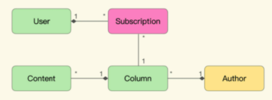

从技术方的角度来说，统一语言和它背后的领域模型，赋予了研发人员通过重构定义业务的能力。那么从业务方的角度来看，如何利用统一语言去影响研发方呢？这就要涉及到“两关联一循环”中提炼知识的循环了，它是DDD的核心流程。

### 将提炼知识的循环看做开发流程
提炼知识的循环大致为：
- 首先，通过统一语言讨论需求；
- 而后，发现模型中的缺失或者不恰当的概念，然后精炼模型，以反映业务的实际情况；
- 接着，对模型的修改会引发统一语言的改变，再以试验和头脑风暴的态度，使用新的语言以验证模型的准确性。

这与重构的过程类似：
```
1. 发现坏味道以明确改进方向
2. 尝试消除味道
3. 通过坏味道是否消失判断改进是否成功
```
也与TDD的过程类似:
```
1. 构造失败测试表明需求变化
2. 修改代码实现
3. 通过测试以证明满足需求
```
提炼知识的循环可以看做以模型为最终产出物的研发流程；如果是重构，业务方就是发现坏味道的人，如果是TDD，业务方就是构造测试的人。

#### 示例
之前极客时间的例子里，抽取的统一语言是：
- 用户（User）
- 订阅的专栏（Subscription）
- 用户可以订阅多个专栏
- 订阅

并用这个语言描述了需求：
```
作为一个User，当我查阅购买过的Subscription时，可以看到其中的教学内容。

当User已购买过某个Subscription，那么当其访问时，就不需要再为内容付费。
```
上述语言中只存在购买过的专栏，但如果业务方有了这有一个新的需求：
```
作为一个User，当我对某个专栏的内容感兴趣时，我可以购买这个专栏，使其成为我购买过的专栏
```
这条业务描述中出现了之前的语言无法表述的概念：未购买的专栏、内容；这意味着当前的统一语言存在无法表述的业务，模型存在漏洞。为了弥补漏洞，团队可以头脑风暴，提取缺失的概念，修改已有的模型，并由业务方判断修改后的模型是不是足够准确表达了业务概念与逻辑。最后可能得到这样的新模型：

重新提取统一语言：
- 用户（User），极客时间注册过的人
- 付费内容（Content）是课程的承载，可以是文字、视频、音频
- 作者（Author)付费内容的创作者
- 专栏（Column）是一组付费内容（Content）的集合，由极客时间的作者（Author）提供
- 订阅的专栏（Subscription），用户付费过的专栏
- 用户可以订阅多个专栏
- 专栏中可以包含多个付费内容
- 同一作者可以发布多个专栏
- 订阅
- 课程发布

于是之前无法被描述的业务逻辑变成了：
```
作为一个User，当我对某个专栏(Column)的内容(Content)感兴趣时，我可以购买这个专栏，使其成为我购买过的专栏(Subscription)
```

### 研发方与业务方的协同效应
提炼知识的循环可以看做以模型为最终产出物的研发流程；另外，对模型与代码是关联的，对模型的修改也就是对代码的修改。如果说统一语言与模型的关联赋予了技术方定义业务的权力，那么提炼知识的循环也赋予了业务方影响软件实训的权利。
综合来看，业务方与技术方的权利义务有：
- 对于技术方来说，通过统一语言获得了定义业务的权力，但同时也要承担在提炼知识的循环中接受业务影响实现的业务；
- 对于业务方来说，提炼知识的循环赋予了它们游戏软件实现的权利，同样需要承担接受研发方通过统一语言定义业务概念的业务；

可见，知识消化以一种权责明确的方式，让业务方与技术方参与到对方的工作中，给与了业务方和技术方一种更好的协同方式。
这样做的好处有：
- 首先，软件开发的核心难度在于处理隐藏在业务知识中的复杂度。为了处理这种复杂度，需要打破知识壁垒（统一语言），如果双方对彼此的知识域有基础的了解（模型），那么知识传递与沟通的效率会更高。
- 其次，对于复杂的问题（没有现成答案的问题），需要快速的反馈周期来试错（提炼知识的循环）

### 当讨论DDD时，我们到底在说什么
DDD至少可以指代一种建模法、一种协同工作方式、一种价值观，以及上述三种按照随意比例的混合。
#### 迭代式试错建模法
针对同一个问题，不同人得到的模型可能是不一样的，模型是对问题的抽象，没有对错，只有角度不同。正如DDD提出者Eric Evans所说：“知识消化是一个探索的过程，你不可能知道将会在哪里停止”，言外之意“你可能不知道当你停止时，得到的是垃圾还是宝藏”，这只能交给建模者的抽象能力了。
DDD之所以会变成如此不靠谱的建模法，是因为它尝试解决的问题是复杂问题，即没有现成答案的问题，那么迭代式试错法就是唯一可行的方法。

#### 具有协同效应的工作方式
权利与义务的对等，构成了协同的基础：
- 对于技术方来说，通过统一语言获得了定义业务的权力，但同时也要承担在提炼知识的循环中接受业务影响实现的业务；
- 对于业务方来说，提炼知识的循环赋予了它们游戏软件实现的权利，同样需要承担接受研发方通过统一语言定义业务概念的业务；

不过这种协同方式是否能发挥作用，很大程度上依赖与团队对模型、对统一语言的理解与接纳，需要团队逐步在工作中使用它。这依赖于建模者的变革管理能力。而知识消化希望通过头脑风暴与试验的方法，简化这种变革，实际结果仍然因人而异。

#### 价值观体系
DDD背后的价值观为：
- DDD是一种模型驱动的设计方法，模型应处在核心；
- 两关联一循环：业务与技术围绕着模型的协调

从这个角度来说，DDD的定义太过宽泛，以至于可以使用DDD去讨论任何事情。所以更建议用“知识消化”来代替DDD，因为“知识消化“除了上述两条外，还框定了具体的实践架构：如何更好地构建富含知识的模型、如何保持模型与软件实现的关联、如何有效地提取领域语言、如何推动业务方更主动地参与提炼知识的循环。

### DDD的特点
- DDD作为建模法，是一种迭代试错法，是一种保底可行，但效率不高的方法；如果技术方与业务方没有足够的信任，可能就迭代不起来了；
- DDD作为一种协同工作方式，提供了相当精彩的思路，统一语言的概念对行业产生了深远的影响；
- 统一语言并不容易实现，而一旦无法形成真正的统一语言，提炼知识的循环也就无法进行，这个方法也就失败了；
- DDD更适合敏捷团队，因为无论是通过统一语言协同交互、还是提炼知识的循环，都需要对这种跨工种协同以及渐进式改进方法有足够的认同。对于敏捷团队方法实施较好的团队，这些都不是问题。否则会有较大的变革成本。

#### 参考资料
极客时间：如何落地业务建模 徐昊