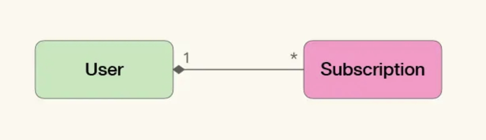

<!-- @import "[TOC]" {cmd="toc" depthFrom=1 depthTo=6 orderedList=false} -->

<!-- code_chunk_output -->

- [业务建模](#业务建模)
  - [解决问题还是定义问题](#解决问题还是定义问题)
  - [业务建模的难点](#业务建模的难点)
    - [如何定义问题并让所有人接受](#如何定义问题并让所有人接受)
    - [如何在特定架构下实现模型](#如何在特定架构下实现模型)
  - [学习业务建模的建议](#学习业务建模的建议)
- [领域驱动设计](#领域驱动设计)
  - [领域模型对于业务系统是更好的选择](#领域模型对于业务系统是更好的选择)
  - [知识消化](#知识消化)
    - [知识消化的五个步骤](#知识消化的五个步骤)
  - [模型与软件实现关联](#模型与软件实现关联)
    - [从贫血模型到富含知识的模型](#从贫血模型到富含知识的模型)
    - [通过聚合关系表达业务概念](#通过聚合关系表达业务概念)
    - [修改模型就是修改代码](#修改模型就是修改代码)
- [统一语言是必要的吗](#统一语言是必要的吗)
  - [统一语言是基于领域模型的共同语言](#统一语言是基于领域模型的共同语言)
  - [修改代码就是改变统一语言](#修改代码就是改变统一语言)
  - [一个简单的统一语言提案](#一个简单的统一语言提案)
- [如何理解DDD](#如何理解ddd)
  - [将提炼知识的循环看做开发流程](#将提炼知识的循环看做开发流程)
    - [示例](#示例)
  - [研发方与业务方的协同效应](#研发方与业务方的协同效应)
  - [当讨论DDD时，我们到底在说什么](#当讨论ddd时我们到底在说什么)
    - [迭代式试错建模法](#迭代式试错建模法)
    - [具有协同效应的工作方式](#具有协同效应的工作方式)
    - [价值观体系](#价值观体系)
  - [DDD的特点](#ddd的特点)

<!-- /code_chunk_output -->


## 业务建模
### 解决问题还是定义问题
业务建模首先是一个定义问题的方法，其次才是解决问题的方法。我们很容易理解解决问题带来的价值，但也很容易忽略定义问题的力量。如果问题定义得准确，那么实现起来也不会太复杂；相反，如果没有搞清楚要解决什么问题，就可能需要用各种奇技淫巧去弥补问题定义的不足。我们有时为了逃避真正的思考，愿意做任何事。

为了有效定义问题，需要从业务出发，首先尝试在业务中寻找简化问题的可能性，然后在技术中寻找对应的解决方案。
明确业务中的关键问题，使用易于实现的模型将业务问题表达出来。

### 业务建模的难点
而一旦涉及软件开发的核心难点，也就是处理隐藏在业务知识中的核心复杂度，除了清晰得理解业务诉求之外，还需要通过建模的方式对这种复杂度进行简化与精炼。
业务建模的方法有很多种，比如着眼于数据库设计的实体关系法（E-R Modeling）、面向对象分析与设计法（Object Oriented Analysis and Design），围绕知识消化的领域驱动设计（Domain Driven Design）等等。
业务建模的真正难点并不在于建模本身，而是：
1. 清晰地定义业务问题，并让所有干系人都接受你对业务问题的定义；
2. 在特定架构的约束下，将模型实现出来。

#### 如何定义问题并让所有人接受
这里的定义业务问题，是指对业务问题的梳理和总结，明确对业务的影响及产出。
这就需要对业务进行提炼总结，并通过所选用的业务建模方法中蕴含的逻辑框架去验证它。如果发现漏洞和不足，要及时提出，让人参与讨论。
这里的挑战不是建模本身，而是如何获取业务方的信任，并展开有效的讨论。
这是能否有效使用业务建模方法的关键。

#### 如何在特定架构下实现模型
建模方法有着更长的生命周期，而技术架构却在不断演化。如果忽略架构对模型的影响，往往会因为不知道如何处理架构约束，而无法将其运用到实际工作中。

### 学习业务建模的建议
- 转移关注点，不必太在意模型是否完美，是否在概念上足够抽象，是否使用了模式。反而，更应该关注如何围绕模型，建立有效的沟通、反馈机制。即该怎么将模型中蕴含的逻辑讲给别人，并让别人听懂、并给出反馈。
- 对架构演化趋势保持足够的关注度。一般每3-5年就会出现新的架构风格。过去15年经历了从单体到多层，再到微服务的改变。在不同的架构风格下，业务建模和模型实现模式的最佳实践会存在差异，而这些差异很可能会决定建模的成败。

## 领域驱动设计
说起业务建模，领域驱动设计（Domain Driven Design）是一个绕不开的话题。
软件开发的核心难点在于处理隐藏在业务知识中的复杂度，那么模型就是对这种复杂度的简化与精炼。领域驱动设计是一种模型驱动的设计方法，通过领域模型（Domain Model）捕捉领域知识，使用领域模型构造更易维护的软件。

模型在领域驱动设计中有三个用途：
1. 通过模型反映软件实现的结构；
2. 以模型为基础形成团队的统一语言（Ubiquitous Language）；
3. 把模型作为精粹的知识，以用于传递；

这样的好处：
1. 理解了模型，就大致理解了代码的结构；
2. 在讨论需求时，研发人员可以很容易明白需要改动的代码，并对风险与进度有更好的评估；
3. 模型比代码更简洁、更抽象，有更低的传递成本；

### 领域模型对于业务系统是更好的选择
“程序=算法+数据结构”这个著名的公式来自于软件行业早期，当时堆、栈、链表等与领域无关的模型，帮开发人员解决了编译器、内存管理、索引等大量的基础问题。这让从业人员形成了一种习惯：**将问题转化为与具体领域无关的数据结构，即构造与具体领域无关的模型**。
而领域驱动设计则是对这种习惯的挑战，它提倡**对于业务软件而言，从业务出发去构造与业务强相关的模型，是一种更好的选择**。
因为如果我们构造的是业务系统，那么团队中就会引入不具有开发背景的业务方参与；这种情况下，与领域无关的数据结构及算法，业务方是不了解的；这种认知上的差异，会造成团队沟通的困难，破坏统一语言，加剧知识传递的难度。
于是在业务系统中，**构造一种专用的模型（领域模型），将相关的业务流程与功能转化为模型的行为，就能避免开发人员与业务的认知差异**。所以领域模型对于业务系统是更好的选择。
这种理念的转变是以面向对象技术开始，直到DDD被行业采纳，才最终完成的。

### 知识消化
不同于软件行业对数据结构的尝试研究与积累，在不同的领域中该使用什么样的领域模型，并没有一个现成的做法。因而在DDD中，Eric Evans提倡了一种叫知识消化（Knowledge Crunching）的方法帮助我们去提炼领域模型。多年来产生了多种知识消化的方法，但它们在宏观上仍然遵从知识消化的五个步骤。

#### 知识消化的五个步骤
1. 关联模型与实现；
2. 基于模型提取统一语言；
3. 开发富含知识的模型；
4. 精炼模型；
5. 头脑风暴与试验；

其中“关联模型与实现”是知识消化可以顺利进行的前提与基础，它将模型与代码统一在一起，使得对模型的修改，等同于对代码的修改。
“基于模型提取统一语言”则会将业务方变成模型的使用者，通过统一语言进行需求讨论，实际上就是通过模型对需求进行讨论。
后面三步则构成了一个提炼知识的循环：通过统一语言讨论需求；发现模型中的缺失或者不恰当的概念，精炼模型以反映业务的实践情况；对模型的修改引发了统一语言的改变，再以试验和头脑风暴的态度，使用新的语言以验证模型的准确。如此循环往复，不断完善模型与统一语言：


以上五步可以总结为“两关联，一循环”：
- 模型与软件实现关联；统一语言与模型关联；
- 提炼知识的循环；

### 模型与软件实现关联
与模型关联的实现方法，是一种面向对象的编程风格，即“富含知识的模型”（Knowledge Rich Model）,与之相对的，过程式的编程风格，则是一种与模型无关的实现方式。面向对象对象技术在表达领域模型上有天生的优势。

#### 从贫血模型到富含知识的模型
在“贫血对象模型”中，**对象仅仅对简单的数据进行封装，而关联关系和业务计算都散落在对象的范围之外**。
比如极客时间的用户和订阅专栏是一对多的关系，“贫血对象模型”类似下面的伪代码：
```
class UserDAO{
    public User find(long id){
        var query = connection.createConnection();
        ResultSet result = query.executeQuery();
        return new User(rs.getLong(1),rs.getString(2));
    }
}

class SubscriptionDAO{
    public List<Subscription> findSubscriptionsByUserId(long userId){
        ...
    }
}
```
这样的代码风格沿用过程式方式，没有发挥面向对象技术的优势。
与之相对的则是“充血模型”，即“**与某个概念相关的主要行为与逻辑，都被封装到了对应的领域对象中**”。这也就是DDD中强调的“富含知识的模型”。按照这种风格，上面的代码可以改写为：
```
class User{
    public List<Subscription> getSubscriptions(){
        ...
    }
}

class UserRepository{
    public User findById(long id){

    }
}
```
从这段代码很容易看出：User是聚合根，Subscription被聚合到User中，无法独立存在。

#### 通过聚合关系表达业务概念
在建模中采用的关联关系中，聚合关系表示关联在一起的对象，从概念上讲是一个整体。在User与Subscription的关系中，如果脱离了Subscription，Use只是单纯的表示个人信息，而脱离了User，Subscription也只是专栏内容，只有把两者放在放在一起，才能表达需要的含义：User订阅的Subscription，它们是一个整体。
比起贫血模型的实现方式，充血模型将模型与软件实现完全对应在一起的，无论是结构还是行为。这简化了理解代码的难度。只要在概念上理解了模型，就会大致理解代码的实现方法与结构。

#### 修改模型就是修改代码
关联模型与软件实现，最终的目的是：修改模型就是修改代码；修改代码就是修改模型。
在知识消化中，提炼知识的重构是围绕模型展开的。如果对于模型的修改，无法直接映射到软的实现上（比如贫血模型），那么提炼知识的重构循环就必须停下来，等待这个同步的过程；否则模型与软件将的割裂，就会将模型本身分裂为更接近业务的分析模型，以及更接近实现的设计模型，这个时候分析模型就会逐渐退化为纯粹的沟通需求的工具，而一旦脱离了实现的约束，分析模型就会变的天马行空，不着边际。

这套做法被无数案例证明难以成功，于是才有了后来的DDD等使用统一模型的方法。

## 统一语言是必要的吗
DDD的核心理念，即在业务系统中使用与问题域相关的模型，而不是通用的数据结构去描述问题。
既然领域驱动设计是一种模型驱动的设计方法，为什么不能让业务方直接去使用模型，而要通过统一语言呢？

### 统一语言是基于领域模型的共同语言
统一语言（Ubiquitous Language）是基于领域模型的共同语言，业务方与技术方通过共同语言描述业务规则与需求变动，为双方提供了协作、沟通的基础。这里的业务方泛指一切非最终软件实现者，比如客户、产品经理、业务分析师、解决方案架构师、用户体验设计师等。
共同语言也有很多种形式，如用户画像、用户旅程、数据字典等；但DDD的统一语言特指根据领域模型构造的共同语言。
回到开始的问题：“既然领域驱动设计是一种模型驱动的设计方法，为什么不能让业务方直接去使用模型，而要通过统一语言呢？”

这是因为这样做的效果不理想：
- 对于研发人员来说，直接使用模型有很多好处，但对业务方来说却不够直观。业务方大多习惯从业务角度如流程、交互、功能、价值等去描述系统，而模型则偏重于数据角度，描述了在不同业务维度下，数据将会如何变化，以及如何支撑对应的计算与统计，业务维度被模型的抽象隐藏了，使业务方无法从模型中直接感知到业务维度。
- 模型是从已知需求中总结提炼的知识，这就意味着模型无法表达未知需求中尚未提炼的知识。所以需要一个相对允许歧义与未知的隔离层，来帮助我们发现和反馈模型的不足。
- 总结来说，需要一种能与模型关联的共同语言，它既能让模型在核心位置扮演关键角色，又能弥合视角差异，并提供足够的缓冲。从模型中提取的统一语言，覆盖了领域模型中的概念与逻辑，还提供了必要的补充，以帮助业务方理解模型。同时，统一语言也扮演了试验田的角色，其中出现的未被提取的知识，将触发提炼知识的循环，逐步完善模型。
相对于模型的精确，统一语言的模糊反而更能满足人与人之间交流的需求。

### 修改代码就是改变统一语言
统一语言是从模型中提取的，于是，修改代码就是修改模型，也会改变统一语言。所以，不仅是因为需求变更，代码重组引起的代码修改，最终也会反映到统一语言中。
这相当于让开发方来定义业务问题，并要求业务方按照开发提出的模型来描述业务和需求。一旦将软件实现与领域模型关联，那么对实现的简化，也就是对领域问题的简化；从实现中抽取的抽象概念，也就是从问题域中抽取的抽象概念。
这种看起来匪夷所思的情况，实际上一直都在发生，技术方一直都在定义业务，只是没有合理的途径让业务方了解并接纳。
统一语言及其背后的领域模型从观念上改变了这一状况，它将大家从各自的领地，也就是业务与技术中，拉到了一个中间地带。双方有了差不多的话语权。
而一旦业务方接受了统一语言，实际上就是放弃了对业务100%的控制权，也就意味着统一语言在业务上能够赋予开发人员更大的控制权，赋予了开发人员定义业务的权力。不多在带来权力的同时，也隐含着额外的义务，即借由统一语言，在提炼知识的循环中，接受业务方的监督与反馈；如果业务方不同意技术方修改的模型，可以修正这种误差，也就是技术人员也丧失了对代码100%的控制权。

总结来说，统一语言提供了一种更好的协同方式的可能性，建立了技术反馈业务的途径，降低了知识消化过程失败的风险。

### 一个简单的统一语言提案
统一语言本身的形式并不重要，或者说并没有统一的形式。重要的是，统一语言与领域模型关联、且多方认可并承认对其的集体所有权时，统一语言才能成为真正的统一语言，在此之前，都只是统一语言提案。

统一语言可以包含以下内容：
- 源自领域模型的概念与逻辑
- 界限上下文（Bounded Context）
- 系统隐喻
- 职责的分层
- 模式与惯用法

以极客时间专栏中User与Subscription的模型为例，可以是：

这个模型非常简单，无法包含上述所有的内容，但根据这个模型，可以从中提取到对应的领域概念，即领域模型中的实体：
- 用户（User），是指所有在极客时间注册过的人；
- 订阅的专栏（Subscription），是指用户付费过的专栏；

同时还有一个业务逻辑：
- 用户可以订阅多个专栏

界限上下文、系统隐喻等其他几项都可以看作对业务维度的补充与展开。将它们引入通过统一语言后，可以帮助业务方更直观地理解模型：
- 系统隐喻就是在价值与业务模式维度上的补充与扩展，比如“某某领域的淘宝”这样的说法，言简意赅地表示了产品的愿景、价值定位、核心模式；
- 职责分层，关注稳定性，哪些是稳定的哪些是易变的；
- 模式与惯用法是业务规则、流程与实现模式；
- 界限上下文是围绕某些模型设置的边界，所有人对于如何对于如何利用边界中的模型有清晰明确的想法，这个想法借由这个边界保持一致，不受外界信息干扰。界限上下文是现实中某种决定在模型上的反应。这里存在订阅子域，订阅也是一个界限上下文。

综上，抽取的语言是：
- 用户（User）
- 订阅的专栏（Subscription）
- 用户可以订阅多个专栏
- 订阅

统一语言是在使用中被确立的。通过定义与解释，我们使这些词语在其所使用的是下文中没有歧义，再通过这些基础词汇，来描述业务中的行为或规则，慢慢就可以将其确立为统一语言了。

这个语言可以用来编写用户需求：
```
作为一个User，当我查阅购买过的Subscription时，可以看到其中的教学内容。
```
可以用来描述行为驱动开发的测试：
```
当User已购买过某个Subscription，那么当其访问时，就不需要再为内容付费。
```
或是实例化需求的说明等等。重点是要在所有可能的地方使用这个语言。只有当所有工种角色都接受它，使用它去描述业务和系统的时候，它才会真正成为统一语言。

`领域驱动设计，逼着业务方和实现方像玩跷跷板一样共同构建业务系统，从协作角度看，这个游戏的特点是，【一个人没法玩】。
板≈共同语言，支点≈模型，以“支点”为中心，以“板”为媒介，双方你一下我一下地玩。“板”+“支点”很大程度上定义了游戏的基本规则。`

## 如何理解DDD

从技术方的角度来说，统一语言和它背后的领域模型，赋予了研发人员通过重构定义业务的能力。那么从业务方的角度来看，如何利用统一语言去影响研发方呢？这就要涉及到“两关联一循环”中提炼知识的循环了，它是DDD的核心流程。

### 将提炼知识的循环看做开发流程
提炼知识的循环大致为：
- 首先，通过统一语言讨论需求；
- 而后，发现模型中的缺失或者不恰当的概念，然后精炼模型，以反映业务的实际情况；
- 接着，对模型的修改会引发统一语言的改变，再以试验和头脑风暴的态度，使用新的语言以验证模型的准确性。

这与重构的过程类似：
```
1. 发现坏味道以明确改进方向
2. 尝试消除味道
3. 通过坏味道是否消失判断改进是否成功
```
也与TDD的过程类似:
```
1. 构造失败测试表明需求变化
2. 修改代码实现
3. 通过测试以证明满足需求
```
提炼知识的循环可以看做以模型为最终产出物的研发流程；如果是重构，业务方就是发现坏味道的人，如果是TDD，业务方就是构造测试的人。

#### 示例
之前极客时间的例子里，抽取的统一语言是：
- 用户（User）
- 订阅的专栏（Subscription）
- 用户可以订阅多个专栏
- 订阅

并用这个语言描述了需求：
```
作为一个User，当我查阅购买过的Subscription时，可以看到其中的教学内容。

当User已购买过某个Subscription，那么当其访问时，就不需要再为内容付费。
```
上述语言中只存在购买过的专栏，但如果业务方有了这有一个新的需求：
```
作为一个User，当我对某个专栏的内容感兴趣时，我可以购买这个专栏，使其成为我购买过的专栏
```
这条业务描述中出现了之前的语言无法表述的概念：未购买的专栏、内容；这意味着当前的统一语言存在无法表述的业务，模型存在漏洞。为了弥补漏洞，团队可以头脑风暴，提取缺失的概念，修改已有的模型，并由业务方判断修改后的模型是不是足够准确表达了业务概念与逻辑。最后可能得到这样的新模型：

重新提取统一语言：
- 用户（User），极客时间注册过的人
- 付费内容（Content）是课程的承载，可以是文字、视频、音频
- 作者（Author)付费内容的创作者
- 专栏（Column）是一组付费内容（Content）的集合，由极客时间的作者（Author）提供
- 订阅的专栏（Subscription），用户付费过的专栏
- 用户可以订阅多个专栏
- 专栏中可以包含多个付费内容
- 同一作者可以发布多个专栏
- 订阅
- 课程发布

于是之前无法被描述的业务逻辑变成了：
```
作为一个User，当我对某个专栏(Column)的内容(Content)感兴趣时，我可以购买这个专栏，使其成为我购买过的专栏(Subscription)
```

### 研发方与业务方的协同效应
提炼知识的循环可以看做以模型为最终产出物的研发流程；另外，模型与代码是关联的，对模型的修改也就是对代码的修改。如果说统一语言与模型的关联赋予了技术方定义业务的权力，那么提炼知识的循环也赋予了业务方影响软件实现的权利。
综合来看，业务方与技术方的权利义务有：
- 对于技术方来说，通过统一语言获得了定义业务的权力，但同时也要承担在提炼知识的循环中接受业务影响实现的业务；
- 对于业务方来说，提炼知识的循环赋予了它们影响软件实现的权利，同样需要承担接受研发方通过统一语言定义业务概念的业务；

可见，知识消化以一种权责明确的方式，让业务方与技术方参与到对方的工作中，给与了业务方和技术方一种更好的协同方式。
这样做的好处有：
- 首先，软件开发的核心难度在于处理隐藏在业务知识中的复杂度。为了处理这种复杂度，需要打破知识壁垒（统一语言），如果双方对彼此的知识域有基础的了解（模型），那么知识传递与沟通的效率会更高。
- 其次，对于复杂的问题（没有现成答案的问题），需要快速的反馈周期来试错（提炼知识的循环）

### 当讨论DDD时，我们到底在说什么
DDD至少可以指代一种建模法、一种协同工作方式、一种价值观，以及上述三种按照随意比例的混合。
#### 迭代式试错建模法
针对同一个问题，不同人得到的模型可能是不一样的，模型是对问题的抽象，没有对错，只有角度不同。正如DDD提出者Eric Evans所说：“知识消化是一个探索的过程，你不可能知道将会在哪里停止”，言外之意“你可能不知道当你停止时，得到的是垃圾还是宝藏”，这只能交给建模者的抽象能力了。
DDD之所以会变成如此不靠谱的建模法，是因为它尝试解决的问题是复杂问题，即没有现成答案的问题，那么迭代式试错法就是唯一可行的方法。

#### 具有协同效应的工作方式
权利与义务的对等，构成了协同的基础：
- 对于技术方来说，通过统一语言获得了定义业务的权力，但同时也要承担在提炼知识的循环中接受业务影响实现的业务；
- 对于业务方来说，提炼知识的循环赋予了它们游戏软件实现的权利，同样需要承担接受研发方通过统一语言定义业务概念的业务；

不过这种协同方式是否能发挥作用，很大程度上依赖与团队对模型、对统一语言的理解与接纳，需要团队逐步在工作中使用它。这依赖于建模者的变革管理能力。而知识消化希望通过头脑风暴与试验的方法，简化这种变革，实际结果仍然因人而异。

#### 价值观体系
DDD背后的价值观为：
- DDD是一种模型驱动的设计方法，模型应处在核心；
- 两关联一循环：业务与技术围绕着模型的协调

从这个角度来说，DDD的定义太过宽泛，以至于可以使用DDD去讨论任何事情。所以更建议用“知识消化”来代替DDD，因为“知识消化“除了上述两条外，还框定了具体的实践架构：如何更好地构建富含知识的模型、如何保持模型与软件实现的关联、如何有效地提取领域语言、如何推动业务方更主动地参与提炼知识的循环。

### DDD的特点
- DDD作为建模法，是一种迭代试错法，是一种保底可行，但效率不高的方法；如果技术方与业务方没有足够的信任，可能就迭代不起来了；
- DDD作为一种协同工作方式，提供了相当精彩的思路，统一语言的概念对行业产生了深远的影响；
- 统一语言并不容易实现，而一旦无法形成真正的统一语言，提炼知识的循环也就无法进行，这个方法也就失败了；
- DDD更适合敏捷团队，因为无论是通过统一语言协同交互、还是提炼知识的循环，都需要对这种跨工种协同以及渐进式改进方法有足够的认同。对于敏捷团队方法实施较好的团队，这些都不是问题。否则会有较大的变革成本。

**参考资料**
极客时间：如何落地业务建模 徐昊