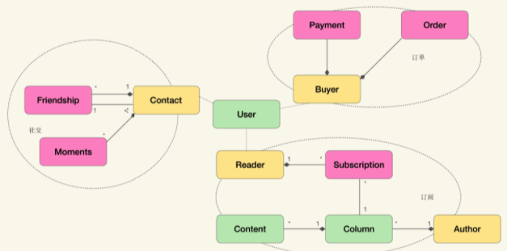
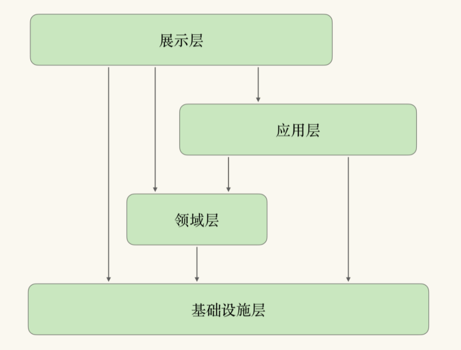
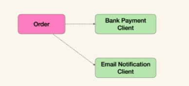
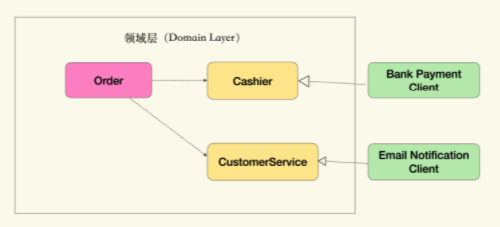
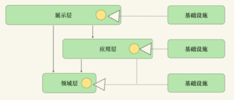

<!-- @import "[TOC]" {cmd="toc" depthFrom=1 depthTo=6 orderedList=false} -->

<!-- code_chunk_output -->

- [关联对象](#关联对象)
  - [无法封装的数据库开销](#无法封装的数据库开销)
  - [引入关联对象](#引入关联对象)
- [上下文过载](#上下文过载)
  - [因富含逻辑而产生的过大类](#因富含逻辑而产生的过大类)
  - [逻辑汇聚于上下文还是实体](#逻辑汇聚于上下文还是实体)
  - [通过角色对象分离不同上下文的逻辑](#通过角色对象分离不同上下文的逻辑)
  - [通过上下文对象分离不同上下文的逻辑](#通过上下文对象分离不同上下文的逻辑)
- [架构分层](#架构分层)
  - [DDD中的分层的问题](#ddd中的分层的问题)
    - [基础设施层与领域层谁更稳定](#基础设施层与领域层谁更稳定)
    - [基础设施不是层](#基础设施不是层)
  - [能力供应商模式](#能力供应商模式)
    - [从基础设施到有业务含义的能力](#从基础设施到有业务含义的能力)
      - [将技术组件进行拟人化处理](#将技术组件进行拟人化处理)
    - [使用能力供应商的多层架构](#使用能力供应商的多层架构)
    - [能力供应商模式的缺点](#能力供应商模式的缺点)

<!-- /code_chunk_output -->


在落地DDD时，关联模型与软件实现总有让人纠结与苦恼的地方，引起这些苦恼的的主要原因是架构风格的变化。我们已经从多层单体架构时代，过渡到了云原生分布式架构，但所采用的建模思路与编程风格并没有彻底跟上时代的步伐。这种差异通常会以性能问题或是代码坏味道的形式出现。
想要真正发挥出DDD的作用，就需要在不同架构风格下，找到能够维持模型与软件实现统一的办法。

## 关联对象
DDD中的聚合关系在具体实现中会存在一些问题。
### 无法封装的数据库开销
聚合与聚合根是构成"富含知识的模型"的关键。通过聚合关系，可以将被聚合对象的集合逻辑放置在聚合或聚合根，而不是散落在外，或是放在其它无关的服务中，以避免逻辑泄露。
但在落地时，经常会遇到一个挑战，即：这些被聚合的对象，通常都是被数据库持久化的集合。对数据库系统操作无法被接口抽象隔离，而将技术实现引入领域模型，则有悖领域驱动设计的理念。

比如在极客时间的例子里，要对用户已经订阅过的专栏进行分页显示，因为性能原因，不能将DB中的Subscription数据全部读取到内存中再进行分页，而要在查询DB时包含分页逻辑。
那么分页逻辑放在哪里，才能保持模型与软件实现的关联呢？
- 一种做法是为Subscription构造一个独立的Repository对象，将分页逻辑放在里面，但这种做法会导致逻辑泄露。因为Subscription被User聚合，那么User所拥有的Subscription的集合逻辑应该被封装在User中。为非聚合根提供Repository是一种坏味道。
- 那么把分页逻辑放到User上呢，这样其实也不合适，因为这样会将技术实现细节引入领域逻辑中，无法保持领域逻辑的独立。

造成上面两难局面的根源在于：我们希望在模型中使用集合接口，并借助它封装具体实现的细节；这基于一个前提，即内存中的集合与数据库是等价的，都可以通过集合接口封装。但实际情况是，我们无法忽略数据库带来的额外开销，两者并不等价。

### 引入关联对象
关联对象是将对象间的关联关系直接建模出来，然后再通过接口与抽象的隔离，把具体技术实现细节封装到接口的实现中。

User与Subscription间存在关联关系，所以新增一个关联对象来表达：
```
public interface IMySubscriptions : IQueryable<Subscription>
{
  ...
}

public class User
{
  private IMySubscriptions _mySubscriptions;
}
```

这里的关联对象为IMySubscriptions，User是Subscription的聚合根，与之相关的逻辑通过_mySubscriptions完成，仍然在User的上下文中，没有逻辑泄露。
然后，再通过接口与实现分离的方式，从领域对象中移除对具体技术实现的依赖，通过依赖注入的方式提供接口的具体实现：
```
public class MySubscriptionsDB : IMySubscriptions
或者数据来源于Restful API
public class MySubscriptionsAPI : IMySubscriptions
```

`关联对象实际上是通过将隐式的概念显式化建模来解决问题的，这是面向对象技术解决问题的通则：永远可以通过引入另一个对象解决问题。`

## 上下文过载
上下文过载（Context Overloading）就是指领域模型中的某个对象会在多个上下文中发挥重要作用，甚至是聚合根。这会导致对象本身变得很复杂、模型僵化；还可能带来潜在的性能问题。

### 因富含逻辑而产生的过大类
假设之前的极客时间例子中，模型经过扩展后，包含了三个上下文：
1. 订阅：用户阅读订阅内容的上下文，根据订阅关系判断哪些内容是用户可见的；
2. 社交：用户维持朋友关系的上下文，可以分享动态与信息；
3. 订单：用户购买专栏的上下文，通过订单与支付，完成对专栏的订阅。

按照这个模型，得到的富含知识的实现为：
```
public class User
{
  // 社交上下文
  private List<Friendship> _friendships;
  public void Make(Friendship friendship)
  {
  }

  // 订阅上下文
  private List<Subscription> _subscriptions;
  public void Subscribe(Subscription subscription)
  {
  }

  // 订单上下文
  private List<Order> _orders;
  public void PlaceOrder(Order order)
  {
  }
}
```
这个实现的问题在于一个对象包含了不同的上下文，即坏味道：过大类，坏处有
- 模型僵硬，想要理解这个类的行为，就必须理解所有的上下文。只有理解了上下文，才能判断其中的代码和行为是否合理。于是上下文的过载就变成了认知的过载，而认知的过载又会造成维护的困难，出现“看不懂、改不动”的祖传代码。而改不动的代码就是改不动的模型，最终提炼知识的循环也就无法进行了；
- 过大类还容易滋生重复代码、引入偶然耦合造成的意外缺陷；
- 性能问题，在不同的上下文中，需要访问的数据也不尽相同（这个问题可以通过引入关联对象缓解）

### 逻辑汇聚于上下文还是实体
上下文过载的根本症结在于：逻辑汇聚于上下文还是实体。
DDD的默认风格是汇聚于实体，类似这里的User类；而如果根据DCI范型（Data-Context-Interaction，数据-上下文-交互），则应该汇聚于显式建模的上下文对象（Context Object）中，或者上下文中的角色对象（Role Object）中。
这样做的原因是因为，在不同的上下文中，用户是以不同的角色与其他对象发生交互的。User在订阅上下文中的角色是Reader，在订单上下文中是Buyer，在社交上下文中则是Contact。
而发生上下文过载的根源为：实体在不同的上下文中扮演的多个角色，再借由聚合关系，将不同上下文的逻辑富集于实体中，导致了上下文过载。
所以解决方案就是：针对不同上下文的角色建模，将对应的逻辑富集到角色对象中，再让实体对象去扮演不同的角色。

### 通过角色对象分离不同上下文的逻辑
一种实现思路是通过装饰器模式，构造一系列角色对象（Role Object）作为User的装饰器：
```
public class Buyer
{
  private User _user;
  private List<Order> _orders;

  public Buyer(User user)
  {
    _user = user;
  }

  public void PlaceOrder(Order order)
  {
  }
}
public class Reader
{
  private User _user;
  private List<Subscription> _subscriptions;
  
  public Reader(User user)
  {
    _user = user;
  }
  
  public void Subscribe(Subscription subscription)
  {
  }
}
...
```
在具体的Repository实现中使用这些角色对象：
```
public class UserRepositoryDB : IUserRepository
{
  public User FindById(long id)
  {
    return db.ExecuteQuery(...);
  }

  public Buyer AsBuyer(User user)
  {
    return new Buyer(user, db.ExecuteQuery(...));
  }

  public Reader AsReader(User user)
  {
    return new Reader(user, db.ExecuteQuery(...));
  }
}
```
之后，就可以类似下面这样获取角色对象了：
```
var user = repo.FindById(1);
var buyer = repo.AsBuyer(user);
var reader = repo.AsReader(user);
```
使用角色对象的好处：
- 把不同上下文中的逻辑分别富集于不同的角色对象中；解决了认知过载的问题，同时也通过封装隔离了不同上下文的变化。
- 从实体对象转化到角色对象经由了显式的方法调用，这实际上清晰地表示了上下文的切换。

但这个方案在揭示意图、技术解耦上还做得不够好；比如假设不是所有数据都来自数据库，社交上下文中的朋友关系来自Restful API调用，这种情况下，将AsContact放到UserRepositoryDB就不合适了。

### 通过上下文对象分离不同上下文的逻辑
既然将角色转换的逻辑放到UserRepositoryDB不合适，那么借鉴前面关联对象的思路，将上下文直接建模出来，并通过接口隔离具体实现：
```
public interface IOrderContext
{
  interface IBuyer
  {
    void PlaceOrder(Order order);
  }

  IBuyer AsBuyer(User user);
}
public interface ISocialContext
{
  interface IContact
  {
    void Make(Friendship friendship);
  }

  IContact AsContact(User user);
}
public interface ISubscriptionContext
{
  interface IReader
  {
    void Subscribe(Subscription subscription);
  }

  IReader AsReader(User user);
}
```
然后将上下文对象的获取放置到IUserRepository接口中，并在其实现中使用依赖注入获取不同的上下文对象：
```
public interface IUserRepository
{
  User FindUserById(long id);
    
  ISubscriptionContext InSubscriptionContext();
  ISocialContext InSocialContext();
  IOrderContext InOrderContext();
}

public class UserRepositoryDB: IUserRepository
{
  //通过依赖注入获取不同的上下文对象
  private ISubscriptionContext subscriptionContext;
  private ISocialContext socialContext;
  private IOrderContext orderContext;
  ....
}
```
最后的使用方式就成了：
```
var buyer = repo.InOrderContext().AsBuyer(user);
var reader = repo.InSubscriptionContext().AsReader(user);
var contact = repo.InSocialContext().AsContact(user);
```
使用上下文对象重构后得到的好处有：
- 借由上下文的封装，不同上下文中的技术实现可以是异构的，不管数据来自数据库还是第三方API，这些细节都不会暴露给使用者；
- 软件实现、模型、统一语言更加紧密地关联在了一起，上下文对象与界限上下文对应。
- 更加清楚地揭示了领域知识的意图，如下图的领域模型：

通过如下IUserRepository的定义可知，User在三个不同的上下文中扮演不同的角色。
```
public interface IUserRepository
{
  User FindUserById(long id);
    
  ISubscriptionContext InSubscriptionContext();
  ISocialContext InSocialContext();
  IOrderContext InOrderContext();
}
```

## 架构分层
如何组织领域逻辑与非领域逻辑，才能避免非领域逻辑对模型的污染。通常会使用分层架构来区分不同的逻辑，将不同的关注度的逻辑封装到不同的层中，以便扩展维护，同时也能有效地控制变化的传播。
不同层有不同的需求变化速率(Pace of changing)，分层架构对变化传播的控制，是通过层与层之间的依赖关系实现的，因为下层的修改会波及到上层。所以希望通过层来控制变化的传播，只要所有层都单向依赖比自己更稳定的层，那么变化就不会扩散了。

### DDD中的分层的问题
在DDD中通常会将系统分为四层：

1. 展现层(Representation Layer)，负责给最终用户展现信息，并接受用户的输入作为功能的触发点。如果不是人机交互系统，用户也可以是其他软件系统。
2. 应用层(Application Layer)，负责支撑具体的业务或者交互流程，将业务逻辑组织为软件的功能。
3. 领域层(Domain Layer)，核心的领域概念、信息与规则。它不随应用层的流程、展现层的界面以及基础设施层的能力改变而改变。
4. 基础设施层(Infrastructure Layer)，通用的技术能力，比如数据库、MQ等。

#### 基础设施层与领域层谁更稳定
在上图的四层架构中
- 展现层最容易改变：新的交互模式、不同的视觉模板都会导致改变；
- 应用层的逻辑会随着业务流程以及功能点的变化而改变，比如流程的重组与优化、新功能点的引入；
- 领域层是核心领域概念的提取，理论上来说，如果通过知识消化完成模型的提取，那么由模型构成的领域层应该就是稳定态了，不会发生重大变化；
- 基础设施层的逻辑由所选择的技术栈决定，更改技术组件、替换框架都会造成基础设施层的变化。基础设施层的变化频率与所用的技术组件有关，越是核心的组件，变化就越缓慢，比如相对数据库，缓存系统的变化频率往往会更快。

此外，基础设施层还可能发生不可预知的突变，比如过去的NoSQL、大数据、云计算都曾为基础设施层带来过突变。而且，周围系统生态的演化与变更也会造成影响，比如消息通知系统从短信变成微信，支付从网银变成移动支付等等。

总之基础设施层没有领域层稳定，但上图中，怎么能让领域层依赖基础设施层呢？

#### 基础设施不是层
领域模型对基础设施的态度是非常微妙的，一方面，领域逻辑必须依赖基础设施才能完成相应的功能，另一方面，领域模型必须强调自己的稳定性，才能维持它在架构中的核心位置。为了解决这个矛盾，要么承认领域层并不是最稳定的；要么就别把基础设施当层看。

领域层被人为地设定为最稳定的，实际上可以将领域层看做“在特定技术栈上的领域模型实现”；但这样可能无法被大多数DDD实践者接受，所以剩下一个选择：基础设施不是层。

### 能力供应商模式
如何才能取消基础设施层，但仍然不影响领域模型的实现呢，可以使用能力供应商（Capability Provider）模式。
#### 从基础设施到有业务含义的能力
假设极客时间的订单需要通过网银来支付，并通过邮件将订单状态发送给客户，模型为：

伪代码：
```
public class Order {
    public void Pay(){
        bank.pay(...);
        email.send(...);
    }
}
```
这样的实现有个问题是领域层的Order直接依赖了基础设施层的网银支付、发邮件功能；而领域层是绝对稳定的，它不能依赖任何非领域逻辑（除了基础库）。

怎么办呢，需要将对基础设施层的依赖，看做一种未被发现的领域概念进行提取，这样其实就发挥了我们定义业务的权利，从业务角度去思考技术组件的含义。

##### 将技术组件进行拟人化处理
通过拟人化，可以清楚地看到技术组件帮我们完成了什么业务操作，比如转账的时出纳（Cashier），通知用户的是客户（Customer Service），于是模型就能转化为：


这样就可以将具有业务含义的能力抽象成接口纳入领域层，而使用基础设施的技术能力去实现领域层的接口，即基础设施层成为了能力供应商。
虽然从实现上看，只是将对具体实现的依赖，转化为对接口的依赖，但这样做的好处却契合了“两关联”：
- 领域模型与软件实现关联
- 统一语言与模型关联

#### 使用能力供应商的多层架构
可以将基础设施看做对不同层的扩展或贡献，它虽被接口隔离，却是其它层的有机组成部分，作为能力供应商，参与层内、层间的交互。


能力供应商是一个元模式，关联对象、角色对象、上下文对象都可以看做它的具体应用。

#### 能力供应商模式的缺点
能力供应商模式有一个缺点是将显式的依赖关系，转化为了隐式的依赖关系，这就对知识管理有了更高的要求。
这里把技术概念转换成了领域概念，并反映到统一语言上，这就需要团队不断地执行循环，才能把知识消化掉。业务方与技术方也需要紧密地配合与信任。

`不要用解决方案去定义问题，而是问题定义解决方案。相同的解决方案，在面对不同的问题是就是不同的模式，比如代理模式 装饰器模式 中介者模式，解决方案都是一个类代理给另一个类，但它们并不是同一个东西`

**参考资料**
极客时间：如何落地业务建模 徐昊