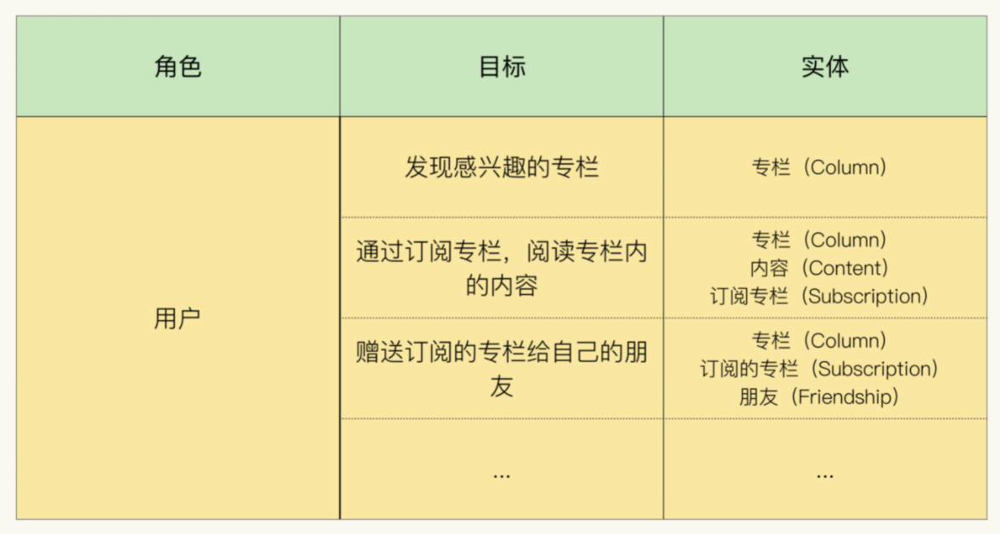

<!-- @import "[TOC]" {cmd="toc" depthFrom=1 depthTo=4 orderedList=false} -->

<!-- code_chunk_output -->

- [统一语言可以是模型本身吗](#统一语言可以是模型本身吗)
  - [业务是模型的隐藏维度](#业务是模型的隐藏维度)
  - [催化剂建模法](#催化剂建模法)
  - [角色-目标-实体法（Role-Goal-Entity）](#角色-目标-实体法role-goal-entity)
  - [事件建模法（Event-Based modeling）](#事件建模法event-based-modeling)
    - [事件建模法的基本原则1：通过事件表示交互](#事件建模法的基本原则1通过事件表示交互)
    - [事件建模法的基本原则2：通过时间线划分不同事件](#事件建模法的基本原则2通过时间线划分不同事件)
  - [事件风暴法](#事件风暴法)
- [怎么才能更有效地获得事件流](#怎么才能更有效地获得事件流)
  - [头脑风暴法的不足](#头脑风暴法的不足)
  - [四色建模法(4 color modeling)](#四色建模法4-color-modeling)
    - [四色建模法的核心逻辑：从收入流与成本结构中寻找事件](#四色建模法的核心逻辑从收入流与成本结构中寻找事件)
    - [四色建模法的具体操作流程](#四色建模法的具体操作流程)

<!-- /code_chunk_output -->

## 统一语言可以是模型本身吗

前面讨论过统一语言的必要性，因为业务维度在领域模型中被隐藏了，而且需要一个缓冲来发现、描述模型中不存在的概念。但这里有一个隐藏的前提假设：最终建模结果将是原味面向对象范型的模型，因为这类模型会将业务维度隐藏。

### 业务是模型的隐藏维度
在极客时间专栏的例子里，用户可以拥有多个专栏，而这些专栏可能是自行购买、朋友赠送、抽奖获得的，而这些都被隐藏在模型的抽象中了。
一方面，这正体现了模型抽象能力的强大，制药厂是相似的数据关联，业务逻辑就可以被保证，细节则可以被忽略；而另一方面，这也增加了业务方理解模型的难度。业务方很难从领域模型中感受到业务维度如流程、交互、功能、规则、价值等等。

如果有办法可以将隐藏在领域模型中的业务维度展开，使业务方能够理解不同的业务流程是如何作用于领域模型的，那么业务方就能够判断领域模型是否准确捕捉了业务概念，以及技术方是否真正理解了需求；这时候就可以把模型本身作为统一语言了。

这种模型称为业务友好与可读的模型，构造这类模型的方法有很多，总体有两个方向：
1. 催化剂建模法及其变体(Catalysis Modeling and its variants)
2. 事件建模法(Event-based Modeling)

### 催化剂建模法
催化剂建模法或催化剂方法是一种尝试将流程视角引入对象建模的方法，它产生于DDD之前，1996年前后。
它有一个称为共享词汇表的核心实践，可以看做催化剂版本的统一语言。但与DDD的区别在于，共享词汇表只包含领域模型的名称，其余的业务逻辑都通过模型自身来表达。
催化剂方法更强调对模型本身的构造，而不是像知识消化那样依赖一个试错的过程去逼近真相。是一种重设计（Big upfront design）的方法。
然而生不逢时，发表后没几年就赶上了敏捷运动，于是迅速被人遗忘了；当催化剂方法在读进入我们视野的时候，是因为我们需要寻找一种更具业务表现力、可作为统一语言的模型，于是催化剂方法又被重新拾起，作为一种将业务维度在领域模型上展开的方法，被引入到DDD中。但我们还是嫌弃他颇为厚重的建模流程，最后逐步被轻量化，产生了很多变体。

催化剂方法最大的特点在于将交互显式地建模到对象模型中；交互（interaction）即可以代表业务流程，也可以是用例或者系统功能，通过使用关系（uses）表示在流程或功能点上使用了哪些对象模型，相当于通过角色和交互为对象模型打了标签（tag），从而将隐藏在模型中的业务维度（流程、功能点）展开了。
使用催化剂方法重新建模极客时间的例子，结构大概是这样：

通过模型可以看到：订阅专栏、送朋友专栏都是通过建立Subscription对象实现的；再配合简单的说明，就可以让业务方理解系统的功能大致是如何被实现的，哪些模型对哪些业务流程有影响。可见展开了业务维度的领域模型完全可以胜任统一语言的功能。

### 角色-目标-实体法（Role-Goal-Entity）
催化剂方法将角色与交互直接建模到了领域模型中，从业务维度展开的角度讲，的确有很多优点；但从技术上将，也存在难以克服的缺点：交互被直接建模到模型中，那么要怎么关联模型与软件实现呢？是选择性地忽略交互与角色，还是将交互实现成某种特定的组件呢？
如果忽略交互与角色，业务维度又被隐藏了，领域模型也就无法担任统一语言；而如果作为特定组件，交互严格意义上又不是领域逻辑。

“角色-目标-实体法”一定程度上解决了这个矛盾。这种方法不再将流程建模到模型中，而是作为发现领域概念的指代。
“角色-目标-实体法”通过一张表格来梳理系统中的角色，他们现在系统上实现的目标，以及在实现这个目标的过程中会接触哪些领域模型中的实体。以极客时间为例，可以得到这有一张表格：

角色-目标-实体法实际上是催化剂方法的简化版，因为没有了交互。它还提供了一种收集需求、结构化进行领域建模与构建统一语言的流程：
1. 首先与业务方沟通，明确参与系统的所有角色；
2. 围绕着这些角色，澄清他们希望通过系统达成的目标；
3. 将目标中提及的“实体”提取出来，问清楚含义与内涵；
4. 围绕这些实体建立领域模型，并与业务方阐述这些模型是如何用以实现目标的。
5. 当业务方理解了模型之后，模型就成为了统一语言。

这个流程还有一个额外的好处：可以提高业务方对领域模型的认同感。
`催化剂方法和角色-目标-实体法，还存在一个缺陷：这些方法得到的是静态模型，没有业务流程。比如专栏可以通过”订阅“得到，那”订阅“的业务流程是什么样的模型里面没提到。作为改进，可以为每个交互添加流程描述。`

### 事件建模法（Event-Based modeling）
业务建模中最难的一步并不是获得模型，而是说服业务方接受模型并作为统一语言，虽然角色-目标-实体法是一种共创方法，但仍然需要经历收集-建模-说服三步。有没有一种方法，可以再讨论中更自然地完成模型共创呢？
答案就是事件建模法。目前比较有代表性的有：
- 事件风暴法(Event storming)
- 四色建模法

#### 事件建模法的基本原则1：通过事件表示交互
催化剂方法中，将交互直接以对象的形式引入到了领域模型中，这虽然在一定程度上展开了隐藏在领域模型中的业务维度，但是在多数情况下，结果的粒度仍嫌太粗。这也是催化剂方法只能用于简单项目，或项目的初始阶段的原因。

模型偏重于数据角度，描述了在不同业务维度下数据的变化；而业务维度中的流程、交互、功能，则更关注行为。那么如何弥合数据与行为之间的差异呢？
事件是一种有效的方法。可以把事件看做行为的印记。比如支付，不需要直接描述支付这个行为，而是通过捕捉这个行为前后的事件：支付发起、支付完成。事件自身能表达的含义有限，但将一系列事件按照顺序排列，就能还原发生过的行为。因而事件发生的时间点就是事件最重要的属性。

在模型中画一条时间轴，依据事件发生的时间点，按先后顺序将事件标记在时间轴上，这样一前一后成对出现的支付发起与完成，就表明存在一个成功的支付行为。
接下来可以根据事件去寻找背后的领域模型，可以按照记述文六要素去想:时间、地点、人物、起因、结果、结果。
- 经过是行为，不需要出现在模型里；
- 时间是时间顺序的依据
- 地点、人物、起因、结果，则是寻找领域概念的依据

在支付例子中：
- 地点，这个场景不重要
- 人物，买家
- 起因，订单，因为需要支付的是订单，那么就可以把起因事件（支付发起）和订单关联
- 结果，支付凭证，把它与（支付完成）关联

于是得到下面更完整的模型：

如上，可以看到事件建模法的优点，这些优点使得事件建模法更容易与业务方完成模型共创：
- 虽然看起来多了一个额外寻找事件的环节，但对于大多数项目而言，建立业务流程或交互流程都是必需的。那么在梳理流程的同时发现事件，或者直接通过事件描述流程，都是惠而不费的操作。
- 通过记述文六要素去寻找领域概念，很自然地就关联了业务维度，提高了业务方对统一语言的接受度。
- 事件建模对于最终得到的领域模型并没有什么额外的限制，它只是一种更自然地发现领域概念的方式。

#### 事件建模法的基本原则2：通过时间线划分不同事件
通过事件的记叙性，可以将流程性的业务维度在模型中展开，但如果事无巨细地将交互都转化为事件，对模型会有较大干扰，如何找到合适的粒度呢？
事件建模法通过引入多条时间线来解决这个问题。通常的做法是区分领域事件时间线，和交互事件时间线。
领域事件指的是发生在领域中且值得注意的事件，通常意味着领域对象状态的改变，这是它与交互事件区分的重要依据。
比如支付发起、支付完成，支付发起不会引起领域对象的变更，而支付完成则意味着会增加一个支付凭证，那么支付完成就是领域事件。

还可以通过引入时间线来细化事件与上下文的关系，比如当设计跨多子域协同的时候，按子域分离时间线可以帮助我们更好地理解子域间的交互：

凡是可以归类为事件建模的建模方法在底层逻辑上都是类似的：通过寻找事件，以及事件背后的领域概念，完成对领域概念的挖掘和建模。
不同方法的差异在于：
- 如何发现事件；
- 事件如何与模型结合。

### 事件风暴法
事件风暴法（Event Storming），于2012年被发明，采用互动式建模工作坊的方式，将不同背景的项目参与方汇聚一堂，集思广益，从而形成有效的模型。它本质上是一种头脑风暴方法。

上图为事件风暴的主要概念：
- 行动者（Actor）是系统的使用者，可以是人或者别的系统。
- 命令（Command）是由行动者发起的行为，它代表某种决定，通常是事件的起因，也称作行动者触发命令（AIC，Actor Initiated Command）；
- 事件（Event），就是前文讨论过的事件；
- 聚集（Aggregate），DDD中的聚合，在头脑风暴；
- 系统（System），指代不需要了解细节的三分系统，可以看做一个整体；
- 阅读模型（Read Model）用以支撑决策的信息，通常与界面布局有关；
- 策略（Policy）是对于事件的响应，通常表示不属于某些聚集的逻辑。通过策略可以触发新的命令，称为系统触发命令（SIC，System Initiated Command）

事件风暴建模的整体流程为：
1. 首先通过头脑风暴寻找领域事件；
2. 根据事件寻找触发它的命令与行动者；
3. 通过事件，寻找策略以及由策略触发的SIC；
4. 根据命令与事件，寻找产生变化的聚合，以及新生成的阅读模型；
5. 根据寻找到的聚合、阅读模型、事件，完善、细化领域模型。

事件风暴法的建模流程遵循事件建模的大体框架，它的特点在于通过头脑风暴发现事件，在依赖触发与响应寻找事件间的关系，通过聚合与阅读模型寻找领域模型。
以极客时间专栏为例，对于场景：用户发现了想看的内容，但因为没有订阅专栏看不了，于是下单购买，完成支付后，再次访问之前的内容，就可以看到了。

首先从事件入手，根据以上流程，得到关键领域事件有：内容请求、访问拒绝、订单确认、订单支付、内容被访问。如下图，事件通常以“名词+动词被动式”表示。

然后寻找AIC与SIC，这里的访问拒绝、内容被访问是SIC，其它都是AIC。
接着寻找AIC各自的触发源、命令，命令通常以“动词+名词”的形式表示，策略的命名则按对应的业务逻辑命名即可，在这里称为访问策略。

确定了事件的源头，接着寻找事件发生过程中，访问了那些聚集，事件完成后生成了哪些阅读模型。
在Place Order - Order Placed阶段，访问了聚集Column，生成了阅读模型Order；
在Pay Order - Order Paid阶段，访问了聚集Order，生成了阅读模型Payment与Subscription。
阅读模型是比聚合更为宽泛的概念，既可以是聚合，也可以是为特定界面或报表生成的特定数据信息。这里通常会以CQRS实现。
内容访问策略需要使用Subscription阅读模型，最终模型如下：

## 怎么才能更有效地获得事件流
### 头脑风暴法的不足
像事件风暴法这类通过头脑风暴获取事件流的方法，不足在于，其成功与否取决于收敛逻辑。
头脑风暴是一种通过发散-收敛来荟萃信息的方法，分为两个阶段：
- 发散阶段：主持人通过引导团队成员，收集他们的想法，产生事件；
- 收敛阶段，主持人则需要根据某种逻辑过来收集到的事件，形成领域事件；

要想更加有效地获取领域事件，关键在于收敛阶段。在发散阶段参与者尽可以天马行空，但在产生有效信息的同时，也会产生大量的噪音。在收敛阶段，则会按照某一逻辑主线，合并相似概念，这个过程中，却极度依赖主持人的经验与自觉，最终结果因人而异。

### 四色建模法(4 color modeling)
四色建模法由thoughtworks CTO徐昊，于2005年左右将事件建模与Peter Coad的彩色建模法结合而发展而成。
四色建模法是一种强分析方法。

#### 四色建模法的核心逻辑：从收入流与成本结构中寻找事件
四色建模法通过三个关键逻辑寻找领域事件，这些逻辑源自企业运营与管理实践：
1. 如果有现金收入，表示承担义务。拿钱办事，需要收集证据，说明义务履约成功；
2. 如果有现金支出，表示拥有权力。花钱消灾，需要检查对方是否按时履约；
3. 对于没有现金往来的，可以通过目标-实际对比，产生类似履约的约束。目标-实际对比，指的是设立一个目标-计划，追踪实际执行的结果。

这三个基本逻辑不是从技术视角臆造的，而是现实中真实运营业务的视角出发的，并且是商业规则的底层逻辑。从它们出发，可以更容易地找到与现实业务相符合的事件流。
在实际经营业务时，除了财务视角（1、2条），还有流程视角（第3条），管理理论认为，企业可以将其核心经营行为，转化为流程（无论是对外的业务活动，还是对内的工作流），然后再通过为流程的执行设定KPI，控制企业经营的效率。支撑KPI考核与收集，也是很多软件系统的本质目标，也是我们需要关注的领域，用目标-实现对比，作为发现、串联事件的主逻辑。

总之，我们寻找领域模型、提取统一语言、做分层与隔离，目的都是为了有效地控制变化和传播。那么我们更应该从源头入手，找到业务中相对稳定的部分去建模，而不是选择一段变化的业务去稳定地构造它的模型。毕竟我们期待DDD能够为我们带来的一切优点，都依赖于尽早地从业务侧隔离开稳定与易变得部分。
而业务模式，是更稳定地部分，对于一家步入正轨的企业来说，在其生命周期内剧烈变化核心业务模式是小概率事件。

业务模式主要通过收入流和成本结构来体现。四色建模法的核心逻辑就源自收入流和成本价格，通过现金权责识别与收入流有关的事件，通过目标-实际对比发现与成本结构关联的事件。

#### 四色建模法的具体操作流程
四种对象原型：
- 粉色，时标对象（moment-interval），凭证、证据、原始单据等，实际上就是领域事件；
- 黄色，角色对象（role），事件参与方在事件中扮演的角色；
- 绿色，参与方（party-place-thing），可以是扮演角色的参与方，也可以具体的人，某件东西，或者某个场所；还可以是与凭证有关的标的物；
- 蓝色，描述（description），对于上述三个对象的描述性信息

具体流程：
1. 寻找关键现金往来，构造一个凭证表示它，然后在凭证上罗列关键数据项，主要有发生的时间点、金额；
2. 针对每一项关键数据项，寻找它的来源，来源只能有三个：用户输入，由前序凭证提供，根据算法计算。需要以此为依据去寻找前序凭证；
3. 回到现金凭证，思考它所对应的权利与责任。这些权利与责任需要哪些凭证证明，并以此为依据，寻找后续凭证；
4. 无论是何种凭证，必须罗列关键数据项，并保证数据项获取的顺畅；
5. 如果与现金往来关联不大，那么寻找关键KPI指标，并构造一个验收凭证表示它。其余步骤与现金往来一致；
6. 在获取了相互关联的凭证流之后（事件流），可以进入模型细化阶段，围绕每个凭证，寻找参与其中的角色；
7. 思考哪些参与方可能扮演这些角色，并将他们加入模型中；
8. 通过描述对象，为模型添加补充说明。

可见四色建模法对最终模型的构造有更为明确的要求：
- 凭证必须围绕现金往来或KPI；
- 凭证间必须通过关键数据项明确关联关系。

这也是四色建模法是一种强分析方法的体现：可经由明确的逻辑推导，不需要依赖于发散-收敛式的探索。

**继续以极客时间举例：**
在极客时间专栏的模型中的现金往来，有读者购买专栏、专栏作者分成。
把这两项构造为凭证，它们都有关键数据项：时间点、金额。

##### 读者购买专栏
读者购买专栏购买凭证中的关键数据项：金额，不可能由读者输入，而应该由前序凭证提供，这个前序凭证就是订单，支付的金额应该与订单相等。订单的金额也不可能由读者输入，它应该来自前序凭证：专栏报价；专栏报价由编辑输入，到此为止，就形成了一条完整的追溯链：

除了凭证的先后顺序，还记录了模型间的计算逻辑和时标顺序逻辑。时标顺序是非常重要的领域逻辑。比如某专栏目前定价199元，但今天14:00会促销变成99元。那么读者在13:59下单，根据约束`Order.placed_at>Column.Quote.available_at`，他必须支付199元，如果这位读者不满意，我们可以追溯信息有理有据地告诉他原因。
所有牵扯到财务往来的业务，都必须接受得起这样的考验，这样才能保障业务经营的顺畅，这也是在事件发生阶段就明确追溯关系的原因。

前序凭证找到了，接下来找后续凭证，即履约凭证。订单支付后，读者就有了阅读专栏的权利，于是引入订阅凭证，它的关键数据项为开始时间，必须晚于支付完成的时间。

##### 专栏作者分成
专栏作者分成具有的关键数据项为金额，这里金额会涉及到规定的分成比例、提取的时间段，这在专栏撰写合同有规定，在建模图补上专栏撰写合同凭证：

到此为止，我们获得了一条由关键数据项彼此关联的凭证链，同时也是领域事件流。这条凭证链表示了从作者签约、专栏定价、读者付费、作者分成的的全程，捕捉了极客时间专栏这项业务的收入流，可以称之为业务的脊梁。
在继续进行下一步之前，可以先来验证一下这个业务脊梁的有效性，看业务能够顺畅进行。首先可以将所有的凭证转化为真实的单据；然后通过角色扮演游戏，让业务方模拟业务的经营。在严重的过程中，除了正常的流程之外，主要需要模拟的是各种业务异常引起的追溯的例子，看看业务脊梁捕捉的数据能保证我们对权责的证明。比如专栏定价修改、作者质疑分成结果等等。

这里也能看到四色建模法的一大特点：**它认为软件系统是业务流程的加速和优化，但是模型是要用以支撑业务运营的，并不仅仅为了构造软件而设计，因为更容易被业务方接受、成为统一语言**。

业务的脊梁被验证有效后，接下来寻找与凭证相关的角色，以及能够扮演这些角色的参与者、还有凭证相关的标的物。

最终得到的模型为：

