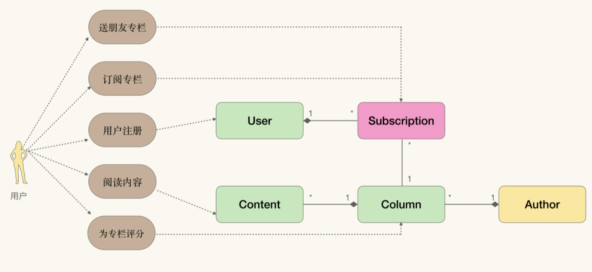

DDD受到行业热捧的一个原因是：它设法寻找到一个在软件系统生命周期内稳固不变的点，由它构成架构、协同、交流的基础，帮助我们更好的应对软件中的不确定性。
而API作为对外暴露的接口，也是需要保持高稳定性的组件。最好能像领域模型一样稳定。于是通过领域模型驱动获得API的设计（Domain Model Driven API Desin），就成了一种非常自然的选择。

### 什么风格的API适合作为模型API
要从数据角度，而不是行为角度去构建API，这样可以保证构建的API能够和领域模型结合地更加紧密。

继续以极客时间为例，如果从行为角度去构建API，可以参考催化剂的模型，因为这种建模方法中包含了交互：


#### 行为角度
从行为角度去设计API，那么会着眼于从人机交互上入手，寻找系统提供了什么服务，并针对这些服务进行API设计，结果类似这样：
```
SendGift(...)
SubscriptionColumn(...)
RegisterUser(...)
ReadColumn(...)
RateColumn(...)
```
这种API风格被称为PRC风格(Remote Procedure Call Style)，在1980年代逐渐称为分布式系统的默认风格。优点是简单直接，提供提供什么功能都在接口里说清楚了；但从默写的角度讲，除非严格使用催化剂方法，否则RPC风格与模型直接有所隔阂，结合地不够紧密，表现在：
- RPC的方法名并不来自于领域对象，交互是一种我们将隐藏在领域模型中的业务维度展开的方法，因为从交互入手，获得的RPC风格API并不是源自领域模型的，而是源自其它业务维度的；
- RPC风格的API消息与返回信息通常也与领域模型无关，而是围绕着交互给出的具体反馈。比如例子中的ReadColumn接口，其返回值一般只包含对应篇章的内容，而不包含与之关联的作者信息。

#### 数据角度
换一个角度看待交互行为：在操作之后，对交互背后的模型带来了什么样的改动。
怎么表示这些API呢？可以先使用URI表示需要修改的对象，然后再说明我们希望这个对象发生什么样的改变。
比如/users表示系统中所有的用户，那么注册新用户，就是新增一条数据，可以用POST /users表示。
通过URI与标准HTTP方法，就可以从数据角度构造与RPC等价的API。模型是从数据变化的角度描述业务的，具体的业务流程反而被隐藏了，那么从数据角度去构造API，自然比从行为角度触发更符合领域模型的特点。
RPC风格实际上是面向过程的编程风格，数据中没有逻辑，要通过过程完成对数据的操作。而数据风格的API，则更多是面向对象风格。

RESTful API是为数不多的从数据角度描述API的方法之一，我们选择它来进行领域驱动API设计。

### 将模型映射为RESTful API
将领域模型映射为RESTful API，可以按这四步进行：
1. 通过URI表示领域模型
2. 根据URI设计API
3. 使用分布式超媒体设计API中涉及的资源
4. 使用得到的API去覆盖业务流程，验证API的完整性

#### 1.通过URI表示领域模型
URI的路径可以看做是对某种层次结构遍历的结果，比如/users/爱学习的鱼玄机/subscriptions，就可以认为是对下面的图结构右侧分支遍历的结果：

这个图实际上是将User-Subscriptions聚合进行实例化之后，再将实例与领域对象结合在一起得到的：

那么看到路径/users/爱学习的鱼玄机/subscriptions或者它的模板化形式/users/{user_id}/subscriptions时，就可以还原出路径背后的利用模型，也就是User-Subscriptions的一对多聚合关系。
通过实例化方式，将领域模型展开成对象图，然后在这种对象图上遍历，就能得到可以表示领域模型的URI路径模板。当然，在理解了实例化与领域模型之间的关系后，也可以直接从领域模型出发来设计URI。
这个过程主要依赖聚合关系，所以需要在领域模型中寻找聚合边界。
比如极客时间专栏的领域模型中，存在两个聚合边界：
1. 以User为聚合根的User-Subscriptions聚合
2. 以Author为聚合根的Author-Column-Content聚合

对于User-Subscriptions聚合，可以设计如下URI模板
1. /users User聚合根，表示系统中的全部用户
2. /users/{uid} User的实例化
3. /users/{uid}/subscriptions，User-Subscriptions聚合，表示某个用户的全部订阅
4. /users/{uid}/subscriptions/{sid} User和Subscription的实例化

其中，1、3表示集合逻辑，无需实例化；2、4表示实体逻辑，需要实例化模型，将它们从概念具象化到某个特定的个体。

#### 2. 根据URI设计API
在根据领域模型得到了URI模板后，就需要围绕着URI进行API设计了。过程比较简单，只需构造这样一张表格，表格中包含：角色、HTTP方法、URI、业务场景。

然后只需填入角色、URI，然后按照穷举法，填入所有的HTTP方法，比如对于/users/{uid}/subscriptions，可以有四行，分别对于GET\POST\PUT\DELETE。
下一步就是寻找业务方反馈，帮助我们判断这些由HTTP方法和URI组成的行为是否存在合理的业务场景。
比如经过讨论，认为/users/{uid}/subscriptions的PUT、DELETE不存在业务场景。

这个过程与角色=目标-实体法类似，其中业务场景是目标，实体则是通过URI表示的领域模型。所以这样的API建模过程，同时也在帮助我们展开业务维度，更好地将领域模型作为统一语言。

#### 3.使用分布式超媒体设计API中涉及的资源
##### RESTful API风格
RESTful API是指符合REST架构风格的API设计，而REST架构风格是对互联网规模架构的提炼与总结。这一切源自Roy Fielding提出的一个问题：既然互联网是人类迄今为止构造的最大的软件应用，那么到底是什么样的结构原则，支撑了如此规模的异构且互联的系统呢？我们能从中学习到什么，以帮助我们更好地构建软件？
Roy Fielding将互联网定义为分布式超媒体信息获取系统，是由超媒体描述的、分布式的信息系统。在这个系统中，信息分布在不同的服务器中，并由超媒体联通。换句话说：分布式超媒体是互联网的集成策略。

##### 分布式超媒体
分布式超媒体可以实现客户端与服务器之间的渐进式服务消费(Progressive Service Consumption)，在客户端的多样性和API的稳定性之间，取得了完美的平衡。
在智能手机流行前，大部分手机浏览器不具备完整执行js的能力，从技术角度讲，CSS、JS都可以看做是对当前页面的增强，CSS增强了当前页面的视觉效果、JS增强了当前页面的交互。
假设极客时间专栏的某篇文章，文本形式是默认服务，此外还有音频、视频形式的增强服务，那么可以在超媒体格式中这样描述这些关联资源：
```
<article>
    <title>***</title>
    <p>...</p>
    <link href=".../chapter11.mp3" rel="voice">
    <link href=".../chapter11.mp4" rel="video">
</article>
```
如果现在有两种三个客户端，分别是阅读器、听书播放器、视频播放器，那么这些客户端就可以根据超媒体拿到自己需要的服务资源而忽略其它资源。

通过使用超媒体，可以用同样的API，支撑起完全不同的客户端，通过超媒体描述的增强服务，让客户端与服务器之间形成了一种协商与匹配的关系，客户端按需索取。

##### 使用分布式超媒体设计API资源
超媒体有两个构成要素，主要具备这两个要素，都可以看做超链接，比如html中的link：
1. 指向关联资源的链接（href）
2. 与主资源的关联关系（rel）

json格式没有提供默认的链接格式，而Internet的一个标准提案HAL(Hypertext Application Language)对此做了定义。
JSON HAL规范示例：
```
{
    "_links":{
        "self":{"href":"/users/1"},
        "subscriptions":{"href":"/users/1/subscriptions"},
    },
    "username":"fakeUser"
}
```
这里self表明获取当前资源的uri，也是PrimaryURI，和ID等价，可以作为 当前资源的标识符，也可以用于缓存。这里self的作用还不明显，但如果是/users资源，那么只能通过self的地址来获取某个user的详情。
subscriptions表示了User-Subscriptions聚合关系。对于聚合根而言，需要为所用的聚合对象提供链接。
借助这种方式，可以将常用数据与全量数据设计成渐进式消费的两种不同服务。再配合缓存，性能也不会受太大影响。REST架构大量依赖缓存来缓解性能问题，能否有效地利用缓存是指会决定REST架构的成败，所以在构造资源的时候，也需要将缓存当做必须考虑的特性，详加设计。

互联网架构的精髓：`服务器永远不需要考虑客户端的需求`，把客户端的额外需求，当做渐进式服务消费的需求，只需要提供对应的链接，剩下的就交给客户端自行处理，通过将集成与订制推向客户端，从而保证服务端的稳定。

#### 4. 使用得到的API去覆盖业务流程，验证API的完整性
最后一步就是，将API作为模型的另一种表现形式，将其映射回所需支撑的业务流程之中，与业务方一起验证这些API是否能够满足所有的需求。
