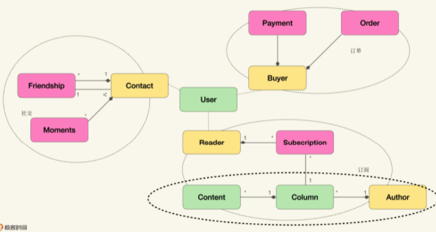

## 弹性边界还是业务边界
前面的内容可以看做对DDD打的两个大补丁：
- 通过不同的上下文对象，弥补原生对象模型从单体架构过渡到多层架构时的各种水土不服；
- 通过不同的建模方法，从业务维度展开入手，以不同的角度寻找可以被建模成对象的领域概念。

如果希望达成如下诉求：
- 采用DDD设计的两关联一循环作为主要沟通协作的方式；
- 将模型作为统一语言，并用于提炼知识的循环；
- 在单体分层架构模式下，将模型的能力通过RESTful API暴露。

那么前几节的内容已经可以满足需求。但如果面对的是更云化的架构风格，比如微服务，那么就无法满足需求了，因为在云时代出现了新的关注点：弹性边界（Elasticity Boundary）。

### 弹性边界
弹性边界是云原生架构的核心概念，指把弹性作为最优先的考虑要素而划定的系统边界；它决定了我们是否能够充分发挥云平台的全部能力。

#### 什么是弹性
云厂商提供的产品的一大特点，就是可以根据流量的改变，动态地调整所需要的基础设施。这种动态调节的能力被称为云的弹性，它是云平台一切美好特质的基础。
而为了实现这种弹性，运行在云平台之上的系统，需要满足一个条件：这个系统可以水平扩、缩容（scaling out/in）

扩容策略从宏观来讲只有两种：
- 水平扩展，增加机器数量
- 垂直扩展，更换更强有力的机器

垂直扩展提供的弹性不可持续，因为机器总有性能的极限，而水平扩展则理论上可以不受限地持续下去。能充分利用云平台能力的架构，就是能够充分利用水平扩展的架构。

**云平台如何实现水平扩展：**
各种基础设施服务云平台（IaaS）有两个核心能力：
- 复制：将镜像复制为机器的能力；
- 剪切：撤销不需要的机器，将其放回资源池的能力。

通过这两个能力，配合预设的阈值，云平台就能对某个镜像提供水平扩展了，这种扩展方案称为弹性负载均衡。

为了利用弹性负载均衡，关键在于将弹性需求不同的组件进行分离。

假设某电商平台的产品目录和支付两个服务，在双十一期间，需要扩容，但两者的流量需求是不一致的，按照实际经验，往往在双十一前，产品目录的流量需求大，而双十一当天，可能支付的流量需求更大。如果把它们拆分为不同的服务，就可以体现这两个不同的逻辑功能在弹性变化上的边界。

通过弹性边界，可以用更细的粒度控制系统的运营成本。而想要真正发挥云平台的能力，寻找合理的弹性边界是最重要的事情。

### 拆分微服务，弹性优先还是业务优先
微服务架构可以被看做一种以业务上下文为弹性边界的云原生架构模式，是云原生架构的一个子集。

毫无疑问，微服务架构可以比单体架构更充分的利用云平台的弹性。但微服务拆分服务的依据是业务上下文，而从弹性边界的角度去审视微服务时，两者很多时候是不一致的，可能从弹性边界看来属于一起的两个服务，在业务上下文视角又需要拆开，那么是否值得将某个业务上下文放入独立的弹性边界内呢？是否值得付出这个成本？
**作者的答案是“弹性优先”。**
如果两个上下文具有明显不同的弹性诉求，则应该拆分，反之，就算不在同一业务上下文，也可以不拆。弹性优先原则是一种功利主义架构思路，主张实际的功用和效果，不要空谈理想。
但服务的独立变更、部署也是弹性。作者认为弹性边界也可以满足这一诉求，但如果将多个业务上下文放入同一个弹性边界，在部署的角度，又显得粒度太粗了，总之弹性边界与业务上下文是不同的视角，两者粒度的粗细随具体场景而变。

### 弹性优先对业务建模的挑战
回到模型驱动视角来看待如何在云时代构造软件的话，会面临两个挑战：
1. 模型该如何体现弹性边界；
2. 在模型中，弹性边界和业务上下文要如何配合。

对于第一个问题，原味面向对象建模中的聚合是一种一致性优先的模型结构，聚合关系可以看做一致性边界，或事务边界，这里并没有一种模型结构用来表示弹性边界。不过界限上下文可以充当这个边界，如图：


第二个问题，业务上下文与弹性边界有时并不重合，比如订阅上下文中，对订阅和内容的弹性需求是不一样的，同一份内容可能会有成千上万的订阅，所以订阅所需的容量可能要远大于内容所需的容量，两者不属于同一个弹性边界。那么弹性边界和业务上下文该如何配合？

## 如何保持弹性边界的独立性
### 弹性边界间的依赖与耦合
就像软件的模块之间会存在依赖关系一样，弹性边界间也会存在依赖关系；不恰当的模块依赖会引发散弹式修改；而弹性边界间的依赖（服务间调用关系、数据交换关系），会造成流量的传递。

以快餐店为例，点餐员负责对接客户，厨房负责制作餐餐食，两者公共协作完成对客户的服务。当客户变多的时候，就会出现排队点餐、取餐的情况。为了缓解排队等待的情况，不仅需要雇佣更多的点餐员，同时还要扩容厨房：雇佣厨师、增加设备。
在这个例子中，可以认为点餐、厨房处在不同的弹性边界，两个弹性边界内的服务共同完成了整个业务流程，而点餐部分弹性的伸缩，会传递到厨房，引起厨房的弹性伸缩。
以上这种不同弹性边界间流量的传递称为**弹性依赖**。在云原生架构下，主要组件之间存在交互，弹性依赖就不可避免。不过云平台更擅长处理**依赖于吞吐量的弹性依赖**，而对**依赖于响应时间的弹性依赖**则没有好的办法。

**依赖于响应时间**：同步调用会出现这种弹性依赖，以快餐店举例，点餐员为一个顾客点菜后，必须等待菜品制作完成，交给客户，才能服务下一位；关注点在厨房的响应时间。
**依赖于吞吐量**：异步调用会出现这种弹性依赖，以快餐店举例，点餐员为一个顾客点菜后，不必等待菜品就绪，就去服务下一位，等菜品制作完成，才回来交给之前的客户。关注点在厨房的吞吐量。

云平台更擅长处理依赖于吞吐量的弹性依赖的原因在于，水平扩展并不能保证改进响应时间，而只能提高吞吐量。弹性扩容实际上是对吞吐量的扩容。
云平台不擅长处理依赖于响应时间的弹性依赖，所以作者将这类弹性依赖称为**弹性耦合**。如果弹性边界间存在弹性耦合，通常意味着，对云平台的利用效率不高，不足以弥补拆分边界付出的成本。

### 如何避免弹性耦合
避免弹性耦合最简单的方式是将组件间的同步调用改为异步调用。这样可以把对于下游响应时间的依赖，转变为对吞吐量的依赖，将弹性耦合变成弹性依赖，使得整个系统可以更好地利用云平台的能力。

### 默认异步对业务建模的挑战
为了消除弹性耦合，需要放弃同步调用这种在云时代之前服务间默认使用的调用、整合方式。以模型驱动的视角来看待这种改变，就会发现两个挑战：
1. 如何将异步调用与模型结合起来；
2. 如何处理异步调用对聚合关系一致性的影响；

原味面向对象建模得到的模型，几乎默认都是同步模型，比如下面用户与订阅的模型：


从模型可以看到，可以创建User、Subscription对象，或者将两者关联在一起，但从模型中，并没有任何结构支持我们以异步的方式来进行这些操作。而异步方式意味着，有模型产生的数据可能存在中间状态，比如为User增加Subscription，可能会存在“请求已发送，但还没有得到明确反馈”的中间状态。

此外，异步中间态还会影响聚合根对关联关系一致性的控制，Subscription关联的一致性由聚合根控制，要么与User关联，要么未与User关联，而在异步模型下，会出现尚未确认的关联，更重要的是，还需要处理在规定时间内没有得到确认的关联，比如5分钟内未能确认将Subscription关联到User，那么需要从关联中移除这个处于中间态的Subscription。

```
前微服务的架构约束：
自治: 前微服务重心在以业务边界拆分独立的作战单元，讲究的是最小完备/自我履行/稳定空间/独立进化。体现就是软件产品化，数据隔离，迭代自由。
容错：前微服务我们一样接受服务总会出错的现实，所以服务间交互会是以依赖集群+自动隔离故障+自动发现新服务（也就是服务治理）的方式。每个发布单元就像人体的一个细胞，生生死死不断轮回，但都不会影响某个器官（服务）的正常运作。
```

**参考资料**
极客时间：如何落地业务建模 徐昊