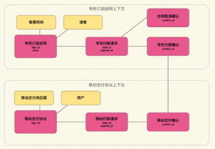
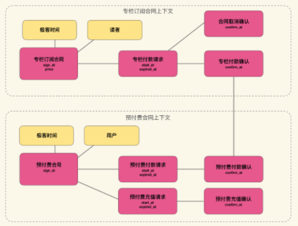
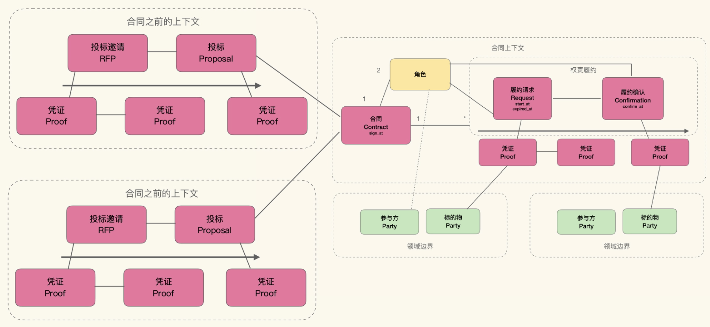

## 业务和领域
在云原生时代，需要将弹性作为首要考虑因素，对于业务建模来说，为了配合云时代的架构约束，需要做到如下几点：
1. 确立一种模型结构以反映弹性边界；
2. 从异步模型的视角，解读业务逻辑；
3. 在弹性边界切分业务上下文时，维护业务一致性；
4. 在异步调用产生中间态异常时，维护业务一致性。

以上便是8X Flow建模法要解决的问题。8X Flow建模法是徐昊继四色建模法之后创建的另一种建模方法。同四色建模法一样，权责追溯仍然是核心理念，但8X Flow更注重通过权责关系，提取业务模式，并通过引入变化点构建可复用的业务模型。更适用于业务平台或业务中台这类系统。
### 业务和领域的区别
继续以极客时间为例，它提供了发布、阅读、评论、定价、购买、返现...等功能。其中发布、阅读、评论之类功能，无论是公开版本还是企业版本都没有什么区别，而定价、购买、返现等功能则会发现较大的改变，更容易受运营模式改变的影响。
整体来看可以把极客时间分为两部分：与运营无关的内容管理系统，以及运营系统。企业版和公开版都有系统的内容管理系统，但两者的运行系统则有区别。
于是可以把系统分解为两部分：与运营无关的部分；提供运营能力的部分。
类似Google、Bing这类搜索引擎，与运营无关的部分是搜索引擎，与与运营有关的部分则是广告投放、竞价等；对于爱奇艺、腾讯视频这类视频网站而言，与运营无关的部分是流媒体部分，与与运营有关的部分则是VIP账户、广告等。
那么领域和业务的定义为：
- 领域，domain：与运营无关的问题域；
- 业务，business：与运营相关的问题域；

针对领域逻辑的模型不怎么需要业务方的输入；而针对业务逻辑的模型则需要业务方的输入和验证。两者具有不同的关注点，比如极客时间，领域逻辑部分的文章、评论等功能，和通用的内容管理系统内什么区别；而业务逻辑部分，设计到如何定价、如何分成等，没有业务方的输入，就无法去构造模型。

如果运营模式改变，业务逻辑部分更容易受到影响。按照隔离变化的原则，应该将两者区分开，两者也拥有不同的弹性边界。

### 领域建模还是业务建模
那么知识消化的“两关联一循环”对于领域逻辑和业务逻辑都是有效地吗，实际上并不是，知识消化对业务逻辑建模的效果要远远好于对领域逻辑建模的效果。

以两个卖烤红薯的人举例，A每天进货，B每周进一次货，那么两者的领域逻辑系统，都是烤红薯的技巧；业务逻辑不同，A会有皮肤的采购操作，B会更多地关注库存管理。
可见，业务逻辑是和某种运营方式绑定的，这个特性称为**运营特定**。而某种业务运营的模式（赚钱的办法）往往与独立于领域逻辑，如果把卖烤红薯改成卖烤土豆，领域逻辑变化了，但与采购、库存管理相关的业务逻辑则没有变化，这个特性称为**领域中立**。

业务逻辑与运营相关，运营本身没有绝对的好坏之分，只有合适与否；大量的业务逻辑其实源自运营实践经验的总结，背后不一定存在什么严谨的逻辑，所谓的专家可能知识经验丰富而已。这类场景更适合使用知识消化的方法来建模、构建业务系统（支撑业务运营，利用领域系统赚钱、省钱的系统）。
而对于领域逻辑，知识消化法不一定是合适的，比如推荐引擎，通过特征建模并使用相似度算法，可能是更好方法。
知识消化法实际上是一种业务建模方法，而不是领域建模方法。
`作者认为：Eric Evan可以从领域逻辑提出知识消化法的原因，在于他没有区分领域和业务，他实际想解决的问题是对业务逻辑的提取；而书中的例子多是领域逻辑，只不过因为领域逻辑更好举例`.

## 通过模型发现业务系统的变化点
### 领域逻辑实际上无法被复用
领域驱动设计畅想的美好的复用方式，大多源自技术领域的领域系统，并将这种复用模式推广到业务系统，却忽略了业务系统的运营特定性与领域中立性，希望可以构造某个领域的通用产品，如数据库一样，可以忽略业务逻辑，在不同企业间形成复用。
但这是不现实的，正如复制了淘宝的功能，也无法再造一个阿里。软件总是简单的，但是构造背后的运营实体，以及确立成本合理的运营模式，才是复用的真正重点和难点。在商业社会中，复用某个领域，就是围绕这个领域构建能够盈利的运营模式，业务知识的重建和复用，才是领域复用的关键。
从这个角度来说，领域驱动设计就是天真的谎言。

### 从合同履约理解业务
对于业务系统，也就是与盈利相关的系统，我们更应该关注的是业务逻辑，将其中的领域逻辑做好隔离即可。
有什么好的办法更好地理解业务系统吗？在我们现行的法律下，所有企业活动必须在合同法的框架之下进行，而且需要满足第三方审计要求。所以有这么一群人，他们可以在完全不了解某公司领域的前提下，快速且充分地了解该公司的业务情况，并指出其中可能存在的问题，这些人就是财务审计、合同审计和职业经理人。
也正是这么一群人，每天都在完成我们眼中艰深的工作：虽然对具体情况了解不多，但能快速且细致地理解业务逻辑。
他们是怎么做到的呢？答案是：以凭证追溯从财务角度理解企业经营，以及从合同履约理解企业义务。
构成审计核心逻辑的凭证追溯也是构成四色建模法的核心逻辑；而合同履约则是8X Flow的核心逻辑。

### 合同履约：8X Flow的核心逻辑
所有的业务活动都徐璈在合同或者具有法律效力的口头约定的框架下进行。
比如网购，之所以能收到货物，是因为我们和网店之间存在采购合同（订单），其中规定了商家有为买家发货的义务，而拿到货物则是买家的权利；而买家有付款的义务，商家也有收款的权利。
权责正常行使的就意味着一次成功的交易。此外，还有大量的业务逻辑是由违约场景构成的。比如网购中，如果在规定的时段内买家不付款，订单会自动关闭；如果是预订订单，商家就有权利不退还预付款等等。
违约场景也是合同上下文中规定的权责项，需要事先约定违约承担的责任。
还有一种情况，如果违约方对于违约责任的承担出现了违约，该怎么办呢？比如触发罚息，但罚息继续不还，进而触发强制要求本金归还，如果再不还本金呢？那就只有去法院打官司了，由法院根据合同中约定的权责履约情况继续裁定，这就是终极履约。

所以在所有的业务逻辑中，**权责履约是最小的业务交互，而合同是最小的业务上下文**。那么就能使用权责和合同上下文对业务进行建模了。

对于权责履约，可以使用履约请求（时间段）和履约确认（时间点）这样的结构来表示。并将相应的凭证和履约请求关联，以表示发起履约的依据。同样，将履约确认与凭证关联，以表示履约的证明。
履约请求是由权利方发起的，并要求义务方在规定时限内完成履约；如果超时就是履约失败。
凭证在权责履约的范围内，可以按照四色建模的方式存在，针对每一个权责履约，实际是在业务上定义了一小段时间线，从履约请求开始，到履约确认为止。这利用了事件建模中的多时间线法。
除了履约时间线上的凭证之外，履约请求还可以引用合同上下文中的其它凭证；特别是履约请求和履约确认本身也是凭证，可以供其它请求与确认引用。比如，卖家未在约定时间内发货，那么违约取消合同时，就可以引用之前的支付履约请求或支付履约确认，证明卖家没有发货。

合同作为上下文对象，涵盖了对应的所有履约项。而且由于合同只存在于双方之间，多方合同可以看做多份双方合同，因而任何合同上下文都存在两个角色对象，比如采购订单中的买家和卖家，快递合同中的邮寄方和承运方等。
所以可以将合同上下文看做两个角色间交互业务的证据的聚合，这是一种业务上的聚合关系，是一种比对象聚合更具有业务含义的包含关系。
合同的参与方以及凭证中的标的物，可能来自领域系统。比如网购中的支付凭证，涉及到标记物是商品，商品可以看做流域系统中产品目录的概念，然后通过凭证引用领域系统中的概念，让领域系统中的概念参与到业务逻辑中来。

### 使用8X Flow建模
对应上述8X Flow的核心概念，其元模型如下：

使用8X Flow建模的流程：
1. 寻找合同上下文，明确合同的参与方；
2. 寻找合同中的主要履约项，按四色建模寻找凭证；
3. 对于主要履约项，寻找违约情况，设立新履约项，按四色建模寻找凭证；
4. 重复步骤3，直到不得不打官司为止；
5 将参与方和标的物划分入领域边界。

### 示例
以极客时间为例，在读者侧，合同为专栏订阅合同，参与方为读者和极客时间。
主要履约项：
- 支付订阅费用，权利方是极客时间，义务方是读者；
- 访问付费内容，权利方是读者，义务方是极客时间；

据此建立的模型如下：

接下来寻找违约情况：
- 未在规定时间内完成支付，那么合同自动作废，读者不承担额外责任，权利方是极客时间，义务方是读者；这个违约项，合同作废是自动行为，不需要业务方确认，所以不需要有独立的权责项。
- 如果专栏断更，没能按说明提供内容，专栏下架，极客时间退款，并且下次同一专栏上架时，不再向原读者收取任何费用，权利方是读者，义务方是极客时间；对于第二项违约，如果极客时间拒不退钱，那么读者也只能走法律手段了，就不需要继续寻找违约项了。

进一步的建模如下如，添加了断更相关的履约项，并将标的无划入单独的上下文，表示领域边界。

从建模结果可以发现：
- 通过request-confirmation表示的履约结构是一种异步结构，在规定时限内，未得到确认之前，履约处在未知状态。这种异步不是技术上的刻意选择，而是业务的真实状态。
- 如果履约出现错误时，即不能履约的情况，那么对于这种异常状态的修正，就需要触发新的履约过程。在现实世界中的业务，不存在可以自动修正的情况，因为如何履约失败，都存在破坏合同条款，最终引起法律纠纷的可能，所以不可能在合同双方不知情，也没有提前协商的情况下，对未完成的履约项进行修正。所以，从业务角度触发，履约中的异常会触发新的履约项，从而在合同的上下文中维持业务的一致性。

### 通过凭证角色化建立合同间的关联
在前面模型中极客时间发出付款请求，读者进行付款，这是一个线下的现金交易模型，双方面对面完成了交易。但实际情况中，往往使用微信、支付宝等第三方支付，于是修改模型，引入移动支付供应商：

在这个新的模型中，引入了移动支付协议，不管是使用哪家的支付服务，用户与支付供应商之间都会存在移动支付协议。
移动支付协议上下文的支付凭证，作为和专栏订阅合同上下文的支付确认凭证，这种跨合同上下文的凭证引用，实际上表示了不同合同履约项中权利方与义务方之间的协作、依赖关系。
合同上下文也是服务边界在业务上的体现，这种边界其实天然存在与业务中。
假设之后有打算引入新的支付模式：预充值抵扣，那么就会依赖另一个合同上下文：预付费合同。

但这就出现一个坏味道，随着新的支付方式的引入，专栏订阅合同上下文会不断依赖新的合同上下文。专栏订阅合同是极客时间的核心业务，支付合同时为了支撑核心业务存在的，让核心咯及依赖支撑逻辑是不合适的。
**为了解决这个问题，可以采用反转依赖的办法，让履约确认角色化，让其它合同中的凭证来扮演这个履约确认。**，如下图：

通过将专栏付款确认角色化，就在专栏订阅合同中引入了一个**变化点**，意味着这个履约项，可以由多种不同凭证来确定，也就存在于其它不同合同上下文交互的可能性。

### 8X Flow所解决的问题
在文章开头提到，云原生时代，需要将弹性作为首要考虑因素，对于业务建模来说，为了配合云时代的架构约束，需要做到如下几点：
1. 确立一种模型结构以反映弹性边界；
2. 在弹性边界切分业务上下文时，维护业务一致性；
3. 从异步模型的视角，解读业务逻辑；
4. 在异步调用产生中间态异常时，维护业务一致性。

其中，前两条与弹性边界有关。合同上下文不是弹性边界，因为在同一个合同中，不同的履约项具有不同的弹性诉求，比如付费内容访问明显比专栏支付具有更多的容量诉求。可见，履约上下文才是弹性边界，此外因为分离了领域逻辑和业务逻辑，所以领域逻辑也是弹性边界。
而通过合同上下文对业务逻辑的聚合，保证了业务的一致性。

后两条与异步模式有关，按照8X Flow的履约请求-确认的模式建模，就会自然地得到异步模式，这根本不是问题，业务本身就应该通过异步解读。

### 以事件建模法使用8X Flow
在合同上下文中聚合的业务逻辑，可以通过履约进行结构化地理解、建模；但对于合同签订之前的业务逻辑该如何处理呢？
在现实的业务中，绝大部分的合同都可以分为如下四个阶段：
- 报价请求 Request For Proposal
- 报价 Proposal
- 合同签订
- 履约

所以合同签订之前的业务逻辑，可以按照事件建模的方法，在合同的不同阶段寻找到对应的凭证，如此可以得到在全生命周期上对8X Flow的元模型：

在这个元模型中可以看到：
- 合同之前的上下文和合同上下文具有不同的弹性边界；合同签订前双方不受合同约束，但合同之前的关键信息最终会体现到合同上，比如砍价、拼单等；
- 合同前的上下文是系统的另一个重要变化点，在合同履约中，不会关心合同时如何生成的，签订合同的途径可能有很多种；
- 报价请求和报价，也具有类似履约请求-确认的结构，也是异步的业务行为。

### 如果系统中不包含合同
如果系统中不包含合同，还能使用8X Flow吗？如果是领域系统那么就不适合；但如果是管理内部绩效的系统，比如客户关系管理系统、销售管理系统等，也是可以用8X Flow建模的；
虽然这类系统并不涉及对外的权责履约，但这类系统也存在履约项，比如干系人的工作产出、KPI、OKR等。这类系统会存在绩效协议，周会、月会，实际上就是进度履约的检查和确认，所以仍然可以用履约框架对其进行建模。

**参考资料**
极客时间：如何落地业务建模 徐昊