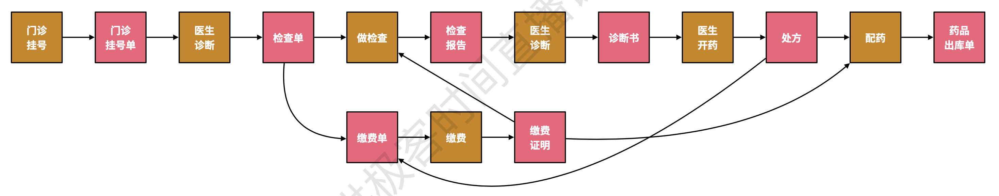
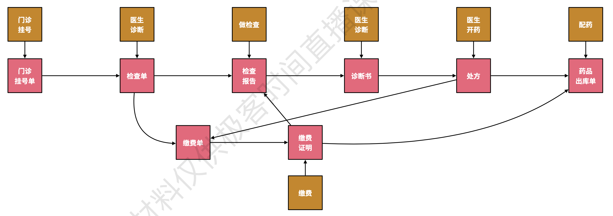
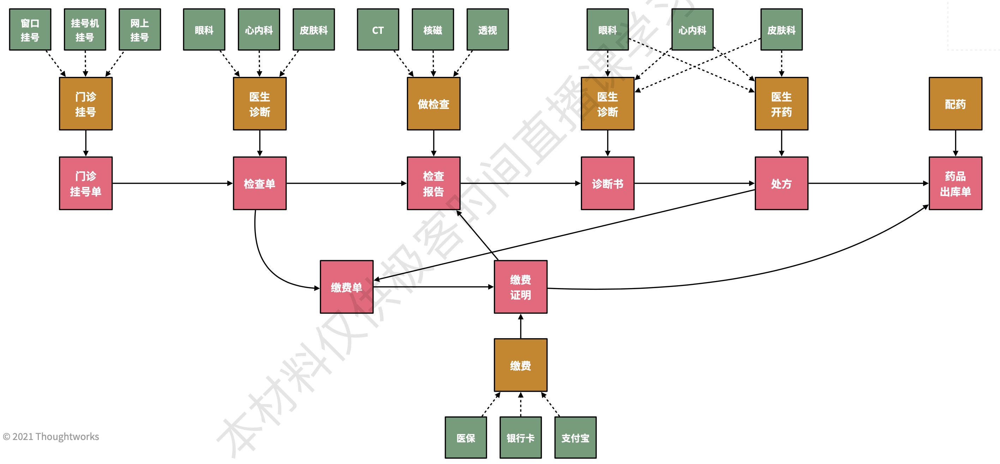
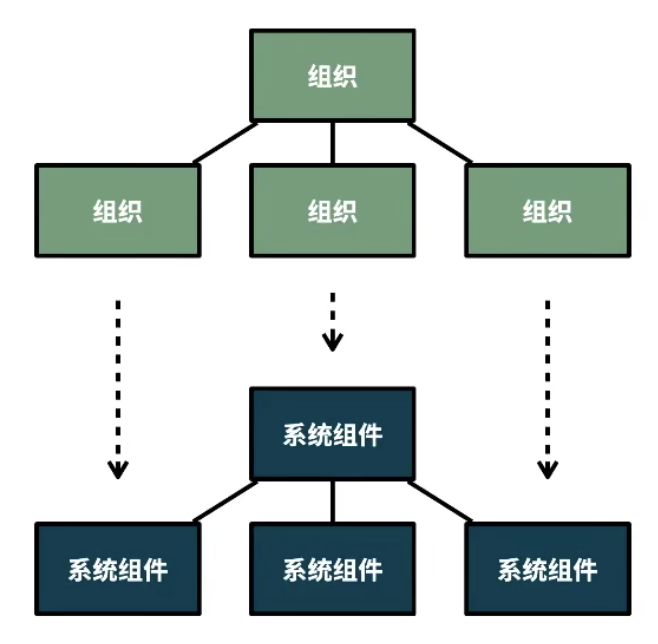
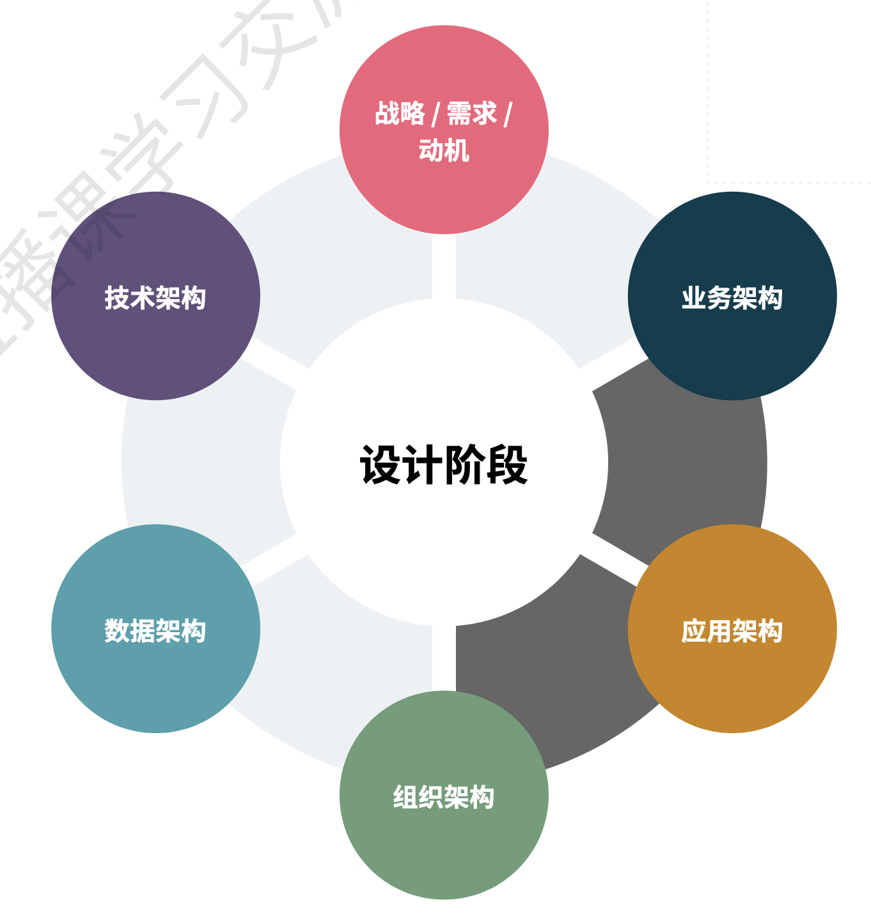
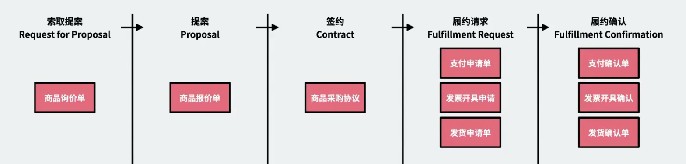

<!-- @import "[TOC]" {cmd="toc" depthFrom=1 depthTo=6 orderedList=false} -->

<!-- code_chunk_output -->

- [业务与领域](#业务与领域)
  - [业务逻辑、领域逻辑](#业务逻辑-领域逻辑)
  - [区分业务逻辑与领域逻辑的原因](#区分业务逻辑与领域逻辑的原因)
- [面向业务设计（Business-Oriented Design）](#面向业务设计business-oriented-design)
- [履约建模法（Fulfillment Modeling）](#履约建模法fulfillment-modeling)
- [面向业务设计与领域驱动设计](#面向业务设计与领域驱动设计)

<!-- /code_chunk_output -->

**面向业务设计（Business-Oriented Design，简称BOD）**，是一种以业务为核心，通过促进业务架构、系统架构、组织架构三者的同构性，从而解决业务系统设计和开发复杂性问题的软件系统架构设计思想。由本次分享者（https://business-oriented.design）胡皓基于履约建模法的核心思想，结合系统架构和软件开发的本质，以及Thoughtworks多年来的软件设计经验和思想总结而来。

**履约建模法（Fulfillment Modeling，又称8X Flow）**，是一套以**业务为核心的，云原生时代的业务建模方法。用于解决以微服务、分布式事务为主导的架构风格中的业务建模问题**。由Thoughtworks中国区CTO徐昊先生从其所发明的四色建模法进一步发展而来。

## 业务与领域
领域（Domain），是一个知识、影响或活动的范围。
业务（Business），是买卖商品或服务的活动。
其中，“领域”更为抽象，可以指代一切问题，比如可以将业务问题描述成“业务领域”，即领域可以与问题互换；这种过高的抽象会导致边界不清。而业务则客观存在且含义明确，这是区分业务与领域的原因之一。
### 业务逻辑、领域逻辑
- 业务逻辑
    - 支撑了业务运营的流程
    - 源自业务运营的逻辑
    - 领域中立、运营特定
    - 其复杂度来自流程本身，关注的是如何盈利、成本结构（对外体现为利润、现金，对内体现为成本、绩效承诺）
    - 常见于：合同、法务、会计、审计
- 领域逻辑
    - 实现了盈利的能力
    - 源自问题域的逻辑
    - 领域特定、运营中立
    - 其复杂度来自问题本身，关注的时如何解决问题（解决办法通常来源于专家经验、研究成果，或参考已有的解决方案）
    - 常见于：算法、计划、统计、优化

以医院就诊流程举例：

其中黄色为领域逻辑，粉色为业务逻辑，完整的流程中通常混合了业务逻辑和领域逻辑。
但实际上业务逻辑有自己的流程，剥离黄色的领域逻辑后，可以清晰得观察到这种流程：

流程中的每个粉色节点都是业务凭证，而业务凭证的追溯过程构成了业务逻辑，且是领域中立的。
而被剥离的黄色的领域逻辑部分，又有自己的变化特点，如对于挂号环节来说，可以在医院窗口、挂号机、上网挂号，从业务追溯的角度来看，业务逻辑只关心这个环节产生的凭证：门诊挂号单，而不关心其产生过程，所以业务逻辑是领域中立的。

另一方面，领域知识的复杂度决定了领域逻辑，且运营中立，领域对业务来说是潜在的变化点。如上图，这次拿医生诊断这个环节举例，虽然业务逻辑只关心最终产生的检查单，但领域逻辑却需要关注检查的过程本身，眼科、心内科、皮肤科有各自不同的领域知识，而且诊断过程依赖医生的专家经验。
如果把图中黄色的领域逻辑看成接口，那么领域逻辑就是业务逻辑中可插拔、可更换的部分。医生诊断的过程不会影响到业务逻辑，而业务逻辑的变化也不会影响到医生诊断的过程，两者是相互独立的。

从复用方式来说，业务逻辑的复用往往通过复制运营团队来实现，而领域逻辑的复用往往通过包装并被业务集成来实现。
如果复用方式没选对，那么设计的架构会有重大缺陷。
上图中粉色的业务逻辑流程，在不同的医院，就算是各种专科医院，也都是相同的，这便是运营团队的复制。
而黄色的领域逻辑部分，比如门诊挂号，可以作为一个统一的接口提供给业务流程；再比如医生诊断，现在有些医院的某些科室是外包出去的，这些形式都可以看作将领域逻辑包装并被业务集成而实现了服用。

### 区分业务逻辑与领域逻辑的原因
- 业务客观存在且含义明确，而领域缺因为过高的抽象而有模糊的边界。
- 业务逻辑与领域逻辑有不同的变化原因，而隔离变化是架构设计的核心
- 业务逻辑与领域逻辑有不同的复用方式

业务系统：以业务逻辑支撑业务运营，利用领域逻辑实现盈利的系统。
业务系统的典型代表即企业架构，企业架构的核心是关注如何使用架构解决企业级的复杂业务运营问题。是当下我们能够接触的较为复杂的业务系统架构。
## 面向业务设计（Business-Oriented Design）
在介绍面向业务设计的概念前，有必要了解下康威定律，由Melvin Edward Conway于1967年提出：任何组织在设计一个系统（广义）时，都会产出一个与该组织的沟通结构一样的设计副本。

传统的软件设计和交付活动建立在组织传统的行政驱动管理方式之上，这会导致烟囱化建设，如以前的政务系统中存在着部门边界，办理事务需要多个部门来回跑。
架构，是系统在其所处环境中的基本概念或属性，体现为它的元素、关系，及其设计和演进的原则。
系统的环境包括：组织发展、技术、业务、运营、组织、政治、经济、法律、法规、生态和社会影响。
对于架构设计而言，如何正确理解并匹配环境的变化，是重中之重。
康威定律描述的是事情的现状，无法指导我们如何做设计系统架构。康威定律的推理-逆康威定律指出：应不断演进组织或团队的结构，从而匹配并促进所期望得到的架构。这样在理想情况下，你的技术架构将与业务架构显示出同构性。这个概念由Thoughtworks的James Lewis于2015年提出。
按照这个概念，好的设计原则应该是这样的：
- 首先要正确理解环境，在问题和需求的基础上，分离出不同的业务边界和领域边界。
- 然后进行元素的匹配，系统边界应与业务、领域边界相匹配
- 团队协作模式也应按照系统边界来划分，即组织边界与系统边界匹配。

**面向业务设计（Business-Oriented Design，简称BOD）**，是一种以业务为核心，通过促进业务架构、系统架构、组织架构三者的同构性，从而解决业务系统设计和开发复杂性问题的软件系统架构设计思想。

**BOD的目的**是促进业务架构、系统架构、组织架构三者的同构性，业务架构指导系统架构的设计，系统架构又指导组织架构的设计。
**这个过程中有3个核心关注的问题：**
1. 通过权责关系理解业务、领域：使用职业经理人、会计、法务人员理解业务的视角，通过权责关系的追溯，理解并分离业务和领域的上下文；
2. 通过业务建模指导设计、实现：以业务为核心，通过明确的逻辑推导过程实施业务建模，利用业务模型支撑业务运营，进而指导系统架构的设计、实现；
3. 通过逆康威定律调整组织架构：遵从逆康威定律，促进组织架构与系统架构相匹配，为架构设计提供基于沟通边界和认知负载的反馈、审视依据。

**BOD所聚焦的阶段**是在业务架构明确后，理解并抽取业务模式，分离业务与领域上下文。以应用架构作为系统架构的牵引，联系业务架构与组织结构，促进同构性。

面向业务设计不直接影响业务架构，也不直接影响系统实现，虽然会有间接促进作用。

**这套方法论的主要目标受众有**：信息技术部门主管、企业架构或业务中台负责人、企业架构师、跨业务或产品的技术负责人、软件咨询顾问，这是因为面向业务设计需要较为丰富的业务知识理解和分析能力、系统架构经验和组织结构影响力，本设计思想更易于被以上群体理解、采纳。
## 履约建模法（Fulfillment Modeling）
首先看一组定义：
**模型**，时客观事物或规律的物理（歼20模型）或抽象（加菲猫卡通形象）的形式化表达方式。
**建模**，就是通过可视化抽象，将客观事物或规律转化为模型表达，从而便于进一步研究和分析的过程。建模法通常都拥有三个关键要素：目标、变量、关系。
**业务建模**，是对业务运营流程或模式的可视化抽象表达。
**领域建模**，没有类似业务建模那样明确的定义，因为领域本身就过于抽象。
领域驱动设计期望用领域模型（统一语言模型）让业务人员和技术人员围绕同一套模型进行交流，但在实践过程中，领域模型往往更靠近系统实现阶段，而非业务设计阶段，其使用者多为技术人员。
**如果放在面向业务设计的上下文中，领域建模的定义为：对领域问题的可视化抽象和分析过程，业务建模的定义则维持不变**
- 业务建模，用于对业务输入进行分析、抽象，从而识别并分离业务上下文和领域上下文；侧重于理解业务、划分边界、分析业务模式
- 领域建模，用于在划分业务、领域上下文后，对领域上下文进一步探索，或指导对象模型的设计；侧重于：理解领域，补充领域问题解决办法，指导实现。

可见，对于业务系统而言，业务建模在前，领域建模在后。

**履约建模法（Fulfillment Modeling）**一种以业务履约关系为视角，通过提取业务模式并引入变化点构建可复用业务模式的、云原生时代的业务建模方法。由Thoughtworks中国区CTO徐昊从其所发明的四色建模法进一步发展而来。

在没有软件系统的时代，一个公对公交易的过程是靠双方的活动过程和纸质单据完成的，这一点回头看医院看病的例子就可以明白了（病人与医院之间会产生针对药品、诊断服务的交易），产生纸质凭证的过程往往都是复杂的领域问题，在交易结束后，时间一长，交易过程会被遗忘，当事双方靠留存的纸质凭证进行过程的追溯。
**业务流程的本质即业务凭证的追溯过程。**
在信息化时代，虽然借助软件系统，交易过程可以被保留更长的时间，但一个业务系统的核心的关注点仍然为业务凭证。
**业务凭证具有不可变性和不可抛弃性**，这是凭证可被追溯的基础。如财务记账时如果内容有误，是不能修改或重开的，只能进行“红冲”，即通过开具一张与原蓝字凭证数额一样的“红冲凭证”来冲抵，然后再重新开具蓝字凭证。
业务凭证，应该只能存在创建，不能修改、删除。那么**从架构的实现来看，对业务凭证只应该提供创建、查询接口。**
业务凭证追溯所体现的是当事双方的权责、履约关系，权责、履约关系在现实中被合约所描述，包含合同、协议，如租房合同。
基于合约进行分析能够快速了解业务上下文，合约可被视为一种能够反映业务流程的有效业务模式。
**履约建模法通过关注合约上下文中，不同阶段的业务凭证进行建模。**
通常一个完整的业务过程都存在如下5个关键阶段，以及每个阶段的业务凭证。

其中履约由履约请求、履约确认组成，履约请求代表一个时间段，而履约确认代表一个时刻。换句话说，**业务天然是异步的。**
合约上下文能够充分地分离业务与领域。

由于业务凭证是履约过程的结果（事件），所以**履约建模法的本质是一种以合约视角为核心的“事件建模法”**。
## 面向业务设计与领域驱动设计
**两者区别：**
- 面向业务设计，目的是解决业务复杂度问题，通过清晰的边界识别，促进业务架构、系统架构、组织架构的同构性；是以演绎法（逻辑推导） 为核心的设计思想。
- 领域驱动设计，目的是澄清并分解问题域，通过协作探索的过程，提升人们对于问题的认知程度，形成统一语言；是以归纳法（发散-收敛 活动）为核心的设计思想。

**两者有不同的使用场景，建议按照如下步骤选择：**
1. 首先识别目标问题是业务问题还是领域问题；
2. 如果目标问题是业务问题，优秀使用面向业务设计，分离业务与领域；
3. 如果目标问题是领域问题，优先寻找并参考同类领域的已有解决方案；
4. 如果目标问题没有可用的解决方案，可使用领域驱动设计进一步探索、澄清。

**参考资料**
《使用履约建模法实施面向业务设计》 胡皓